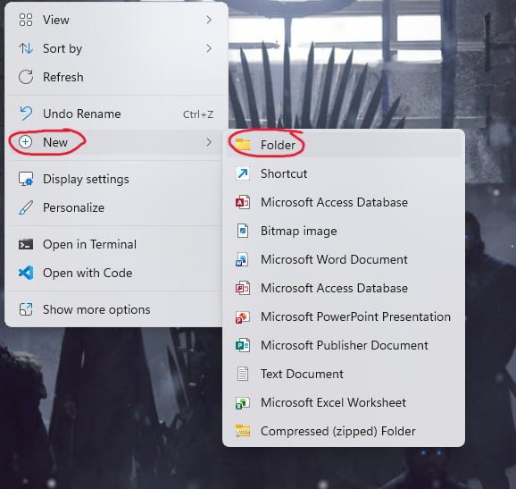
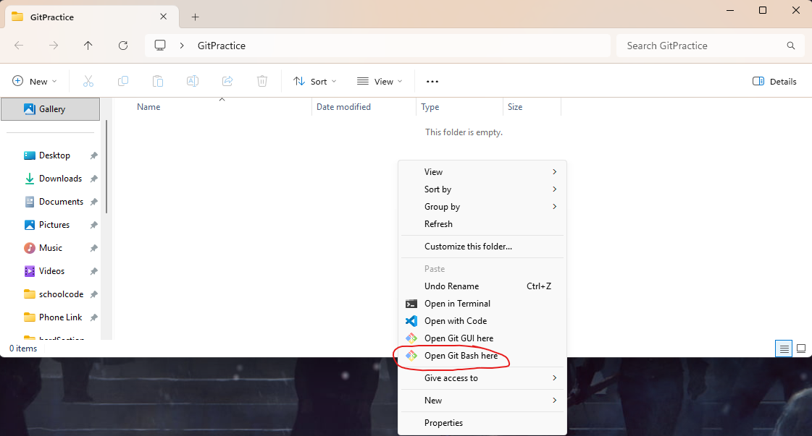
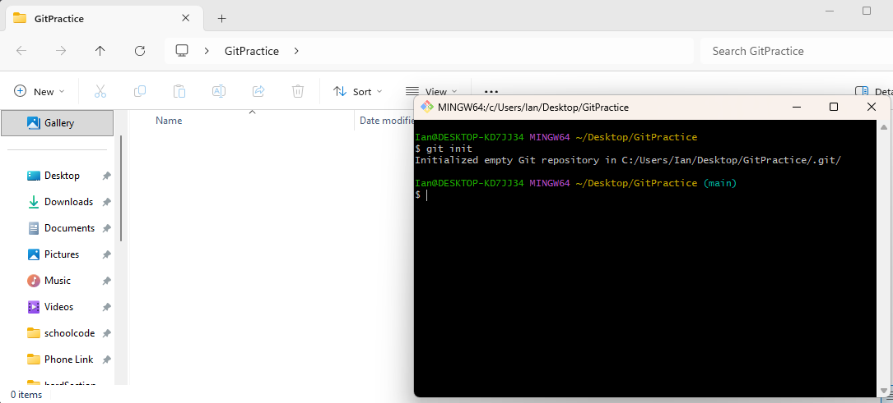
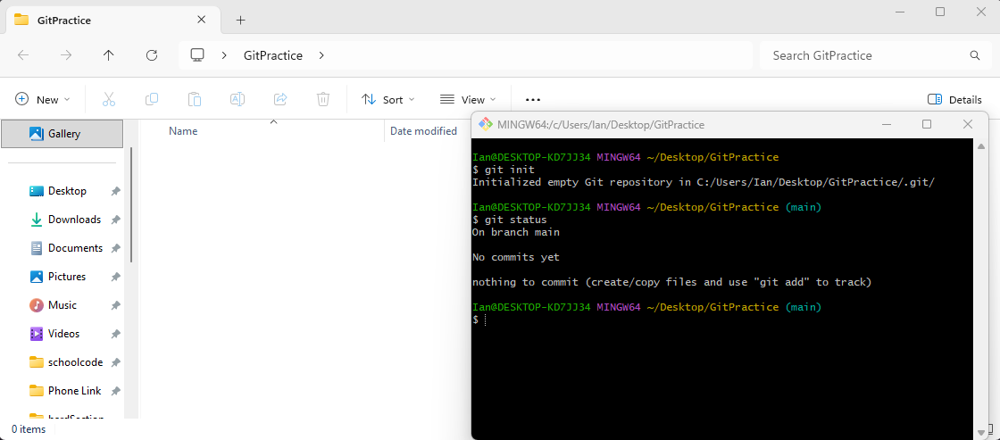
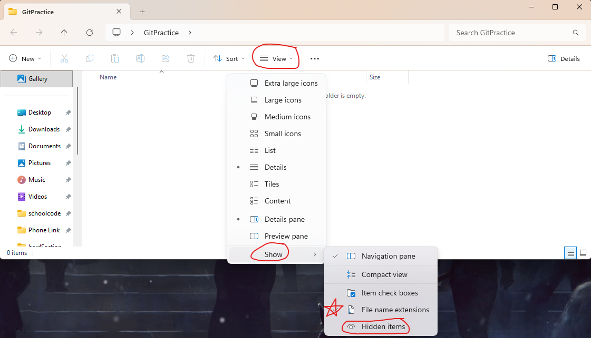
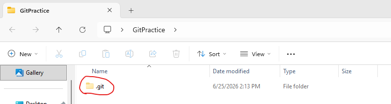
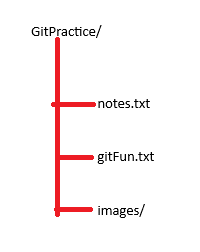
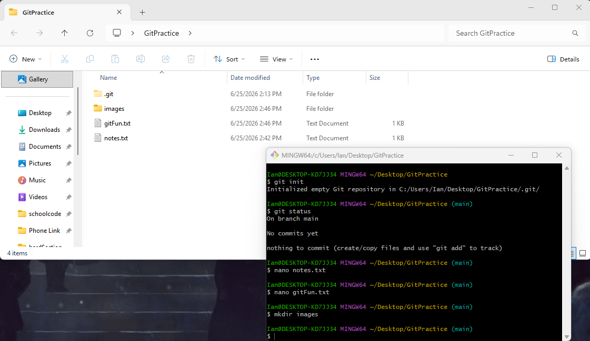
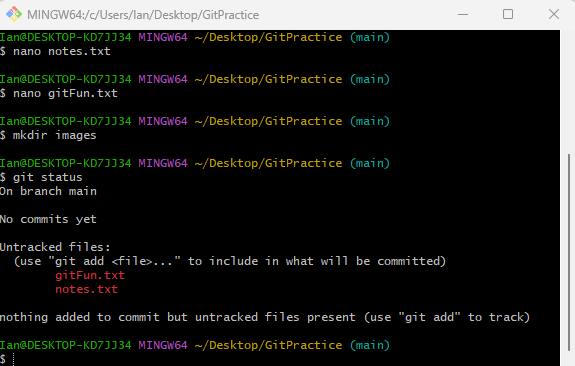
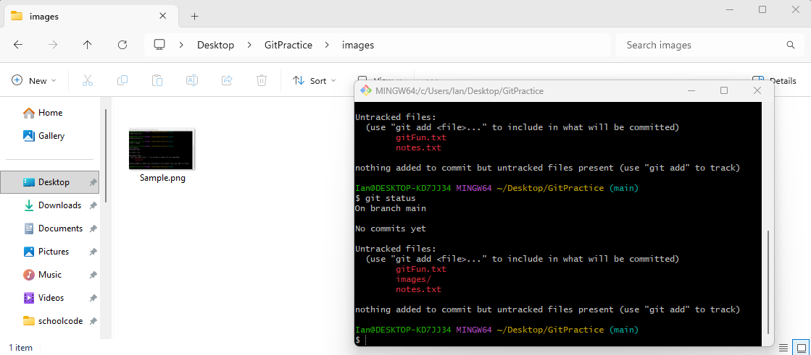

# Creating a Local Repository

## Learning Objectives

1.  Create a new local repository.

2.  Verify a repository's status and how it changes.

3.  Learn how to view hidden files.

------------------------------------------------------------------------

### Step 1: Create a Project Folder

Let's start by first creating a project folder on our desktop. To do
this, simply right click on your desktop and hover over the option "New"
and select folder.

{width="3.3901596675415573in"
height="3.2083333333333335in"}

Name the new folder as GitPractice (with no spaces in the folder name,
spaces are bad for command line control).

### Step 2: Initialize a Repository

If you have not already installed Git with Git Bash included, now would
be the time to go back to that tutorial and download it as we will be
using it here.

Go into the new file we named GitPractice and right click in the empty
space inside the folder. If you are on Windows 10 you will see the
option to click "Open Git Bash Here", go ahead and click it and a
terminal will appear. If you are on Windows 11, click on the option that
says "Show More Options" and then you will see the Git Bash option.

{width="6.5in"
height="3.4965277777777777in"}

In the terminal that appears, you should use the command git init. After
you run that command, the terminal will respond with output that says an
empty Git repository was created at the file path where your project
folder is found. Git has now transformed this ordinary folder into a
repository.

{width="6.5in"
height="2.941666666666667in"}

### Step 3: Verify the Repository's Status

Next, we will the command git status. The output we are expecting to see
that we are "on branch main", "no commits yet", and "nothing to commit".
The branch being on main, if you remember from the basic terminology,
means we are on the default branch. There are no commits because we just
made this repository and there is nothing to commit because we don't
have any files in our project yet.

We now know that Git is actively tracking this directory.

{width="6.5in"
height="2.861111111111111in"}

------------------------------------------------------------------------

## The .git Folder

After running "git init", Git creates a hidden folder within the project
named ".git". The .git folder contains the commit history of the
project, branch information, configuration settings, object database,
metadata, and more.

IMPORTANT:

NEVER MANUALLY EDIT FILES WITHIN THE .git DIRECTORY.

## Viewing Hidden Files

Despite my major warning not to edit files within the .git directory, I
do find it relatively important to show you how to see hidden files and
folders so that you are aware of their existence. "With great power,
comes great responsibility." This is especially true with the .git
folder, as if you mess with files that you shouldn't be and you don't
know what you are doing, you could lose the contents of the repo
forever.

To view hidden files and folders, in the project folder select the
"View" drop down menu, then "Show", and select the "Hidden Items"
option. I would also suggest showing file name extensions, but this is
optional.

{width="6.5in"
height="3.7284722222222224in"}

Once this is done, we can see that our project folder is not completely
empty and it does in fact have the .git folder. Hidden files/folders are
usually denoted with a slightly transparent image of their equivalent
type (i.e. a slightly transparent or faded folder compared to the normal
folder). Hidden files/folders in windows are also usually named with a
"." preceding the name of the folder or file.

{width="6.5in"
height="1.7284722222222222in"}

## Hands-On Guided Activity

Create the following file structure:

{width="2.1770833333333335in"
height="2.7431266404199475in"}

The "/" at the end of a name like GitPractice denotes that this is a
folder and not a file.

Since we already have the folder named GitPractice, we need to just
create the 2 text files and then the folder to mimic this structure. If
you do not already have Git Bash opened in the GitPractice folder, you
should do so now.

Commands:

nano notes.txt \-- this command will open a text editor called nano,
type something fun into this text file and then press CTRL+S and
afterwords CTRL+X to save the file and then exit the file.

nano gitFun.txt \-- this command does the same thing as the previous,
but now creates a file called gitFun.txt. Write "Git is Fun!" in this
file.

mkdir images \-- A folder is a directory, as such mkdir (which stands
for make directory) creates the folder named images.

After creating these files and folders from the command line, your
terminal should look something like this and you should be able to see
the files in the folder now!

{width="6.5in"
height="3.7631944444444443in"}

Next, run the command git status again. Observe how Git now detects the
new files found in the project folder!

{width="5.990418853893264in"
height="3.8130325896762907in"}

Git now tells us that there are untracked files in the repository. Take
note that Git does not detect the images file, that is because there are
no files currently within the folder. Until there is something added to
that folder, we will not be able to detect it. So, add your favorite
image to the folder using file explorer and rerun the command.

{width="6.5in"
height="2.8520833333333333in"}

Now we see that the "images/" folder and its contents are being
detected!

------------------------------------------------------------------------

## Knowledge Check:

1.  What is the purpose of a repository?

2.  What command creates a new repository?

3.  What hidden folder is in every Git repository?

4.  What command displays a repositories status?
