# Installing Git on Windows, MacOS, and Linux

## Learning Objectives:

At the completion of this tutorial, learners will be able to:

1.  Differentiate between Git and GitHub.

2.  Identify the two ways of interacting with Git that we have
    installed.

3.  Download and install Git on the operating system of choice.

4.  Verify that Git has been installed successfully.

5.  Explain the purpose of changing configuration options for username
    and email.

------------------------------------------------------------------------

In this guide we will teach you how to download and install Git on your
preferred operating system. Although the process is mostly the same on
Windows, MacOS, and Linux, there are a few platform-specific differences
that we will discuss.

Before we begin the tutorial, it is important to understand the
distinction between Git and GitHub. Git is the version control software
used on your computer that allows you to track changes to files and
projects. GitHub is a cloud-based hosting platform that allows you to
store Git repositories online.

In the installation process, we will be installing Git and the two most
common ways of interacting with it:

- Git Bash- This is a command line interface (CLI) that allows you to
  interact with Git using the command line. Bash is actually an acronym
  that stands for Bourne Again Shell, which is the successor of the
  original Unix command line shell created by Stephen Bourne.

- Git GUI- This is a graphical user interface (GUI) that some people
  find easier to use than command line tools to interact with Git using
  graphical menus and buttons rather than commands.

By the end of this guide, you will have Git installed, a way or ways to
interact with it, and be ready to create and manage repositories at the
local level.

## Windows Installation

### Step 1: Download Git

The first thing you need to do is open your preferred browser and
navigate to this link to download Git from the official webpage:
<https://git-scm.com/download/win> .

You need to download the version of Git that is appropriate for your
architecture. For your convenience, you can run the command below in
PowerShell to confirm what architecture your computer is running. (You
can find PowerShell by clicking the search bar on the bottom left and
searching the term \`Power\`.)

Get-CimInstance Win32_OperatingSystem \| Select-Object OSArchitecture

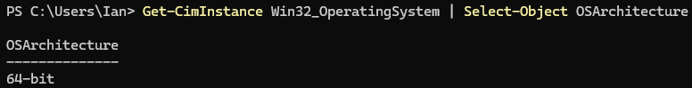{width="6.5in"
height="0.8291666666666667in"}

This command will either return 64-bit like in my case or ARM64 if you
have an ARM processor. If your output looks like mine, you will select
the option that is circled in the image below. Otherwise, if it says
ARM64 select the option below the circled option.

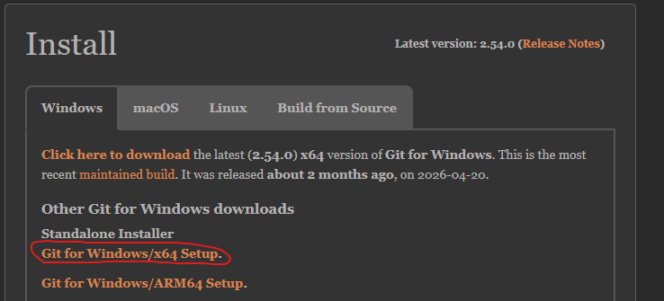{width="6.5in"
height="2.95in"}

### Step 2: Run the Installer

Find where you downloaded the installer and double click it to launch.
If you are prompted by Windows to allow the installer to make changes to
your computer, you need to give it permission by selecting "Yes".

### Step 3: Configuring the Installation Options

Below are a series of screenshots showing the options you should select
for installing Git. Some of the images have no explanation because they
are relatively straightforward (such as agreeing to the privacy
agreement). There will be explanations for less straightforward options!

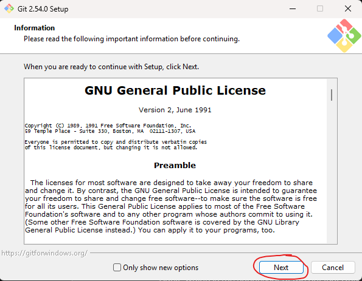{width="3.9583333333333335in"
height="3.080182633420822in"}

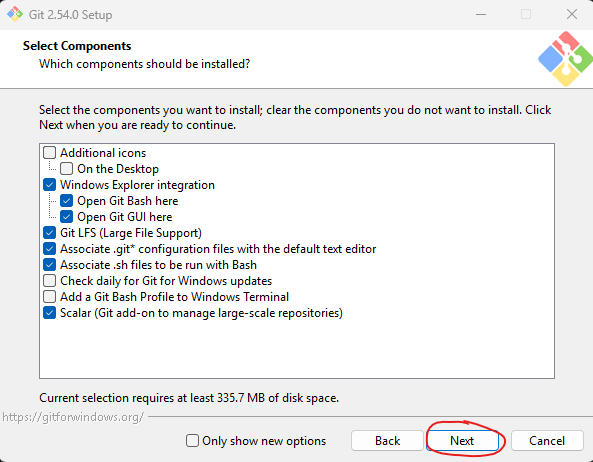{width="3.9791666666666665in"
height="3.100126859142607in"}

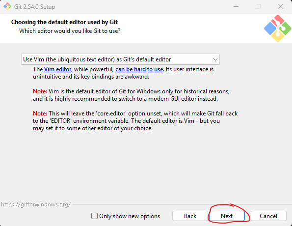{width="3.9895833333333335in"
height="3.084384295713036in"}

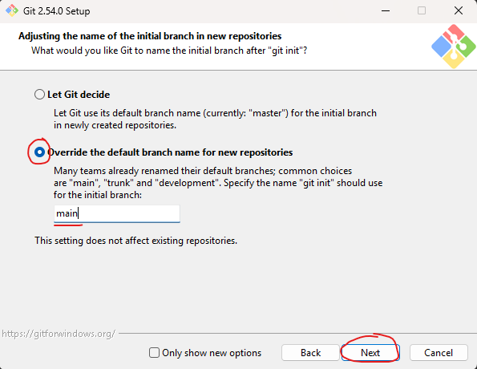{width="4.0in"
height="3.092438757655293in"}

We are going to make a change on this page by selecting the override the
default branch name for new repositories. The default is to let Git
decide, but we want to make this change for simplicity's sake. If you
let Git decide, when creating repositories your default branch would be
"master" instead of "main", but when creating repositories from Git Hub
like we will be later, the default branch will be "main" by default. By
making this change, we can ensure that our default branch is "main"
regardless of how we create our repository.

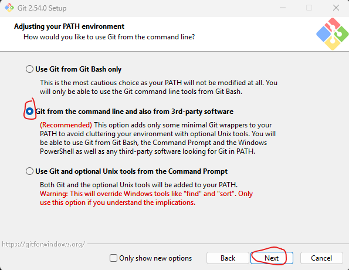{width="3.260643044619423in"
height="2.5208333333333335in"}

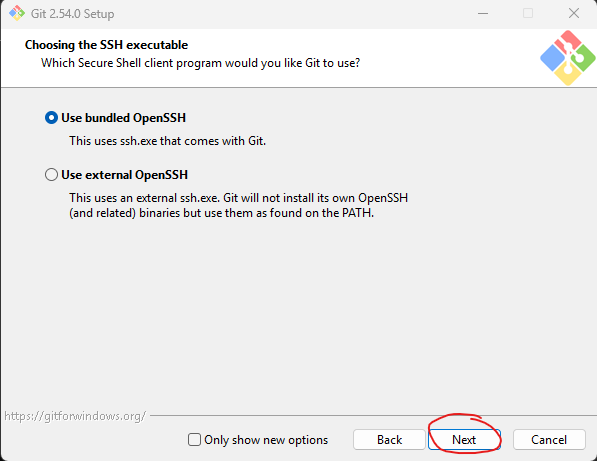{width="3.251017060367454in"
height="2.5104166666666665in"}

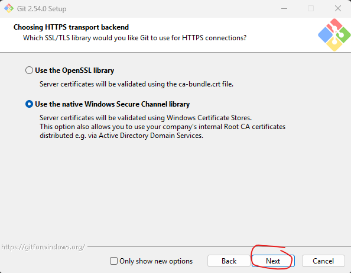{width="3.207836832895888in"
height="2.4895833333333335in"}

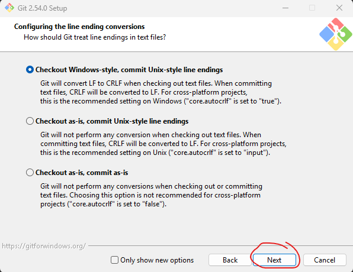{width="3.2796194225721784in"
height="2.53125in"}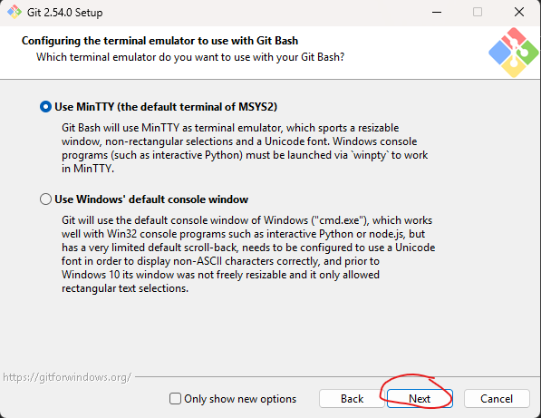{width="3.2645067804024497in"
height="2.5208333333333335in"}

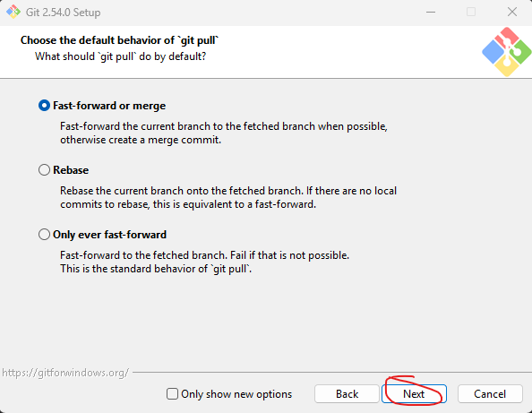{width="3.263888888888889in"
height="2.5330850831146106in"}

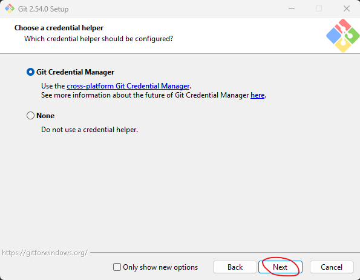{width="3.1660356517935258in"
height="2.4583333333333335in"}

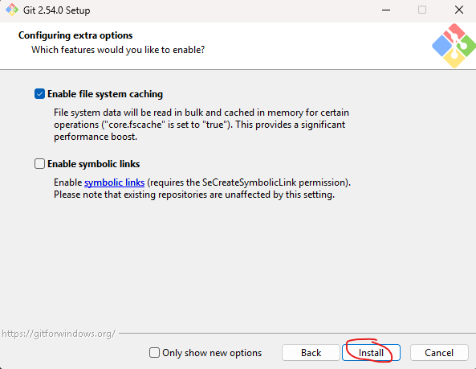{width="3.176017060367454in"
height="2.4583333333333335in"}

After you click install, you will need to wait until the installer has
finished. You have successfully installed Git if you see this window at
the end. You may click finish.

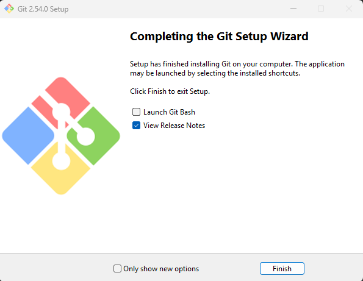{width="3.8020833333333335in"
height="2.94581583552056in"}

Skip to the Verifying Installation Section!

## Linux Installation

### Step 1: Ensure Package Installer is Updated and Download Git

We will be downloading Git from the command line on Linux as it is the
easiest way to do so.

Navigate to your command line and use this command to both update your
package installer as well as install Git.

sudo apt update && sudo apt install git

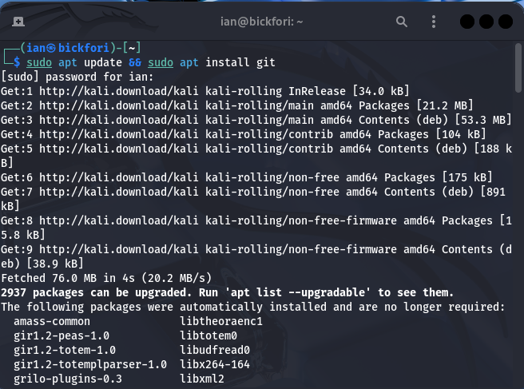{width="3.6041666666666665in"
height="2.6757852143482066in"}

There can type "y" whenever it prompts you to for permission to do
something during the installation. It may also ask you if it is allowed
to restart some services that are affected by the installation, to which
you should select yes as well.

As long as there are no errors in the installation, this is the only
step we need to do for the Linux version.

Skip to the Verifying Installation Section!

## MacOS Installation

### Step 1: Check if Git is Installed

On newer versions of MacOS, Git is actually installed by default. You
can check this by running the command within the Mac terminal:

git \--version

### Step 2: Install Git if Needed

If Git is not installed, terminal will prompt you to download the
developer tools for Mac. You can select yes and install it this way if
you choose.

Alternatively, you can click on the link from the Windows guide,
navigate to the Mac installation options, and then download it from
there selecting the same options as in the Windows guide where
applicable.

## Verification of Installation

To verify your installation of Git, you need to navigate either to CMD
(Windows), command line tool of choice in Linux, or Terminal in MacOS
and run this command:

git \--version

If you see the word git followed by a version number, you know that you
have Git installed.

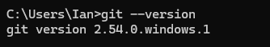{width="3.4796522309711286in"
height="0.6146686351706037in"}

## Configuring Your Git Username and Email Address

Before we do anything with Git, we need to make sure that Git knows who
we are! Why does this matter? Well, we know that Git has the ability to
see the commit history of a repository by showing who has changed what
and when. To make this possible, we need to tell Git who we are, so it
knows who to attribute changes to. This becomes much more important when
we start working with remote repositories in later sections; so just
ensure it is an email account that you can access!

Think of this information as being your digital signature attached to
every commit you make, giving you the credit for the work that you have
completed. This further allows team members if you are on a team project
be able to reach out to the author of some work found in the team
project!

To start the process of changing our configuration we need to open Git
Bash. To do so, right click anywhere on your desktop. If you are using
Windows 10 or earlier, the option for "Open Git Bash Here" should
already be available. If you are using Windows 11, you need to select
the option for "Show More Options" and then you will be able to see the
"Open Git Bash Here" option.

For the remainder of the guide, we will mostly be working with Git on
Windows as that is my operating system of choice. However, the commands
are the same regardless of operating system and anything that does not
work the same way as it does in Windows, a quick ChatGPT inquiry will
fix! This is done to alleviate the amount of redundant content and
streamline learning, not operating system bias.

## Setting Your Username

Once we have opened a Git Bash terminal, we will find ourselves at the
dreaded command line. Fret not, it's not as scary as it may seem if you
have never worked at the command line before.

The command for changing your username configuration is:

git config \--global user.name "John Doe"

All you need to do now is change the John Doe to your actual name, and
you want to make sure to include the quotes. To check to see if your
name was configured correctly, use the same command but leave out the
name and quotes like this:

git config \--global user.name

This is what your console should look like:

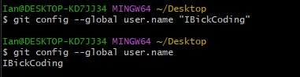{width="3.969304461942257in"
height="1.0313943569553805in"}

## Setting Your Email

Next, configuring your email address is just as straightforward as the
username step. This time we will replace the user.name to user.email as
such:

git config \--global user.email john.doe@example.com

All you need to do is once again replace the email with your
corresponding email address! Check once again that it has been
configured correctly by running the same command without the email
address and quotes!

# What's Next?

Now that we know what Git is, a basic understanding of how Git works,
and Git knows who we are; we are finally ready to make our first
repository and start tracking changes to our files!
