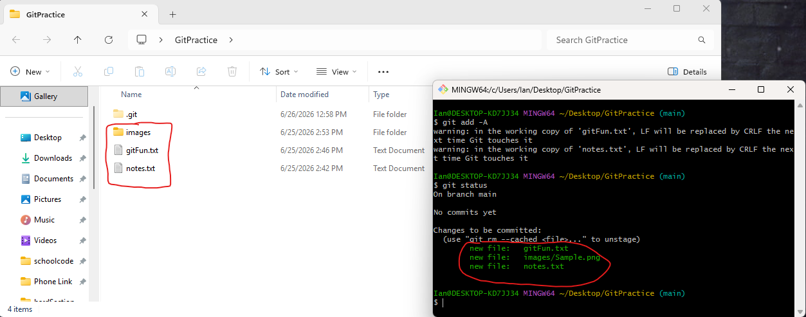
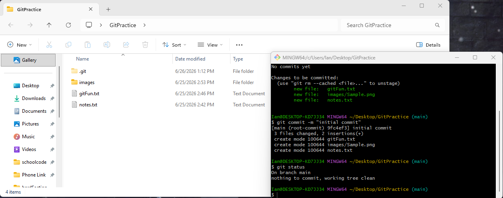
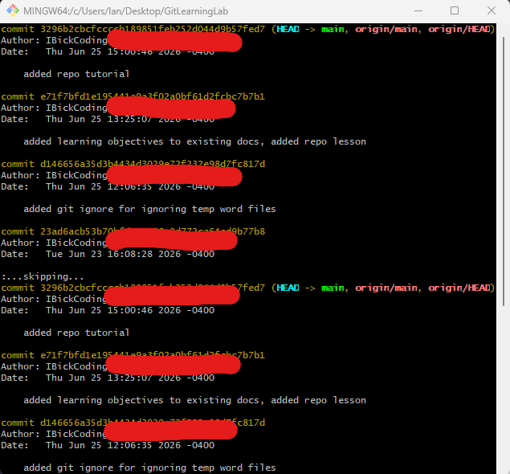

# Making Commits and Tracking Changes

## Learning Objectives:

At the completion of this lesson, learners will be able to:

1.  Explain the Git workflow.

2.  Differentiate between the Working Directory, Staging Area, and
    Repository.

3.  Stage files using git add.

4.  Create commits using git commit.

5.  View commit history using git log.

6.  Explain how Git tracks changes over time.

------------------------------------------------------------------------

## Introduction

To remind you where we last left off, we created a folder named
GitPractice. Inside this folder, we used git init to create a
repository. We then used the command line to create 2 files and a folder
in the repository. When we used git status, we saw that the files were
being detected but had not been added or committed.

In this lesson, we will work all the way through the Git Mental Workflow
Model that we went over in one of the first lessons of the Beginner
section. To refresh, the model flows as such:

Working Directory 🡪 Staging Area 🡪 Commits.

The reason this is important to recap, is because each step of this
model has an action or actions that must be done prior to moving to the
next step.

## The Working Directory

The working directory contains the files that you are actively creating
or editing. All work to files is done in the working directory, fitting
name huh? As we have discovered though, Git may notice that something
has changed in the files but it is not yet tracking those changes. To be
able to get to the next step in the workflow model, we must add the
files to the staging area.

## The Staging Area

To add files to the staging area, we will simply use the command git add
-A. This command will add all changes to the repository to the staging
area. There are variations of this command that you can use instead of
the "-A" argument (these will allow you to add just a single file, all
files within just a folder, etc.), but in most cases "-A" will suffice.

To move files from the staging area to the next step in the workflow
model, we need to commit our changes.

## Commits

To finally commit our work that we have done, we will use the command
git commit -m "initial commit". This command tells git to commit the
files that are in the staging area with the message (-m is the argument
for writing a commit message) initial commit. Once we have done this,
not only is Git tracking the files that we have created and edited, it
also just took a snapshot of how the files look at this exact point in
time for us to reference later.

------------------------------------------------------------------------

## Hands-On Guided Exercise

### Step 1: Add files

Let's take the work from the previous tutorial and add the files to the
staging area. To do this, open the folder named GitPractice from the
previous tutorial, then right click in the empty space and select "Open
Git Bash Here". To add the files to the staging area, use the command
git add -A.

Once we have done this, use the git status command to review what has
changed! Instead of the status telling us that we have untracked files,
git is now tracking these files and instead telling us that we have 3
new files to be committed.

### Step 2: Commit the Files

To commit the files, we will use the command we went over earlier and
use git commit -m "enter message here". For this message, since it is
our first commit, it is customary to use the commit message "initial
commit". After your first commit, typically your commit message is a
very short description of the changes you have made.

After we have committed, you will get output that gives you a quick
summary of the actions that were done in this commit. The output tells
you the commit ID, commit message, how many files were changed, how many
files were created, how many files were deleted, how many changes within
the files, and a summary of all files that were committed. If you check
git status, you can see that there is nothing to commit, no untracked
files, and the working tree is clean (working tree clean just means
there are no new changes to stage).

### Step 3: Check the Commit History

To check the commit history and see the changes that have been made to
the repository over time, you can use the command git log. This will
give you details about every commit that has been done to repository,
along with the commit hash, author, date, and the commit message. For
this repository, it is a little boring because we have made one commit.
But for a repository that has had a lot of commits, such as the one
hosting this course, it is quite extensive. Below is an image of this
course:

## How Git Tracks Changes Over Time

Does Git store copies of files every time you change it? If that were
the case repositories would very quickly grow to a ridiculous size and
would be impractical.

However, Git is clever with how they take their snapshots of files.
Instead of storing the entire file in its current state at each commit,
Git instead keeps track of the differences between versions of the file
at different commits. This way, Git is able to piece together what a
file looks like at a given commit by referencing the differences between
the version of the file at the current commit against an earlier commit.
These differences are often referred to as \"diffs\", and this is an
oversimplified explanation of the internals of Git but works for our
current understanding.

Essentially, every time you make a commit, Git is checking to see if
files were changed, if they were, it saves the "diffs". For example, in
a repository with the files 1stFile.txt and 2ndFile.txt, the internals
of Git kind of look like this:

**Commit 1**

1stFile.txt

2ndFile.txt

↓

*Edit 1stFile.txt*

↓

**Commit 2**

1stFile.txt changed, saves the diff

2ndFile.txt unchanged

↓

*Edit* 2ndFile.txt

↓

**Commit 3**

1stFile.txt unchanged

2ndFile.txt changed, saves the diff
