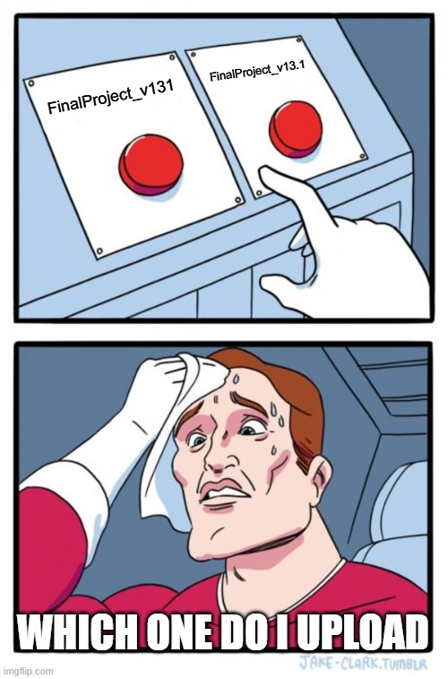
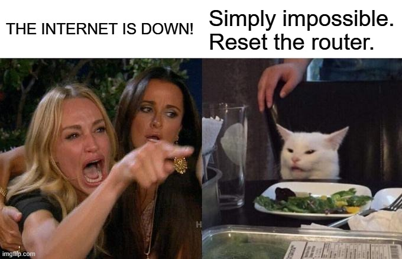
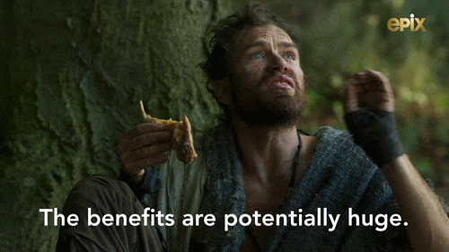
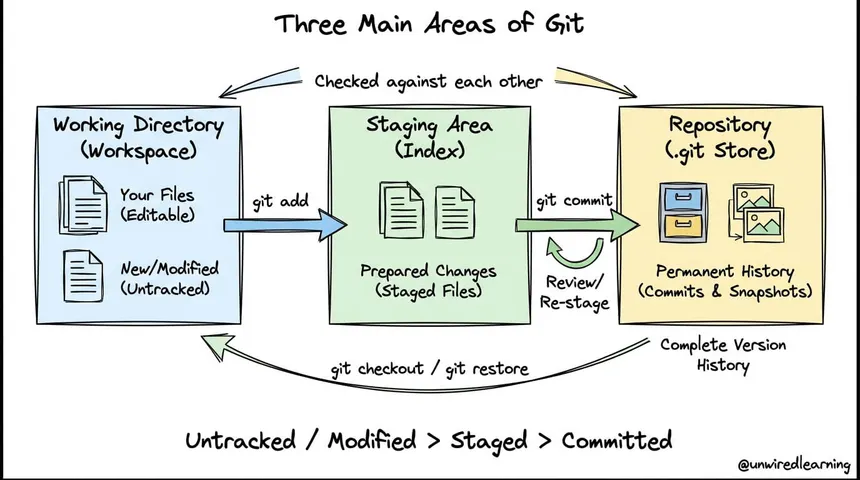

# Introduction to Version Control and Git

## Learning Objectives

At the completion of this lesson, learners will be able to:

1.  Define version control and explain its role in software development.

2.  Describe the benefits of using version control software such as Git
    both in a team setting as well as using it as an individual.

3.  Differentiate between version control and source control.

4.  Explain the basic purpose of Git and other version control systems.

5.  Define and apply basic Git terminology.

6.  Explain the mental Git workflow model.

Before we begin working with Git, we should first understand what
version control is and why it matters. You may have heard the terms
*version control* and *source control* used interchangeably in
conversation, but are they the same thing? Although the two terms are
closely related, there are some subtle differences between the two.

Have you ever had to work on an important school project with a partner?
You probably shared the project through email, Google Drive, or even a
USB thumb drive if you are old enough. As each person made changes, the
file was passed back and forth until the project was complete.

To avoid overwriting each other\'s work, you may have created new
versions of the file. Each time you created a new version of the file,
you probably added the day's date to end of the file name. If you were
really "cool" like me, you added the version number at the end instead.
Each file name becomes some variation of \`FinalProjectv2.docx\`
incrementing the number at the end each time. Before long, it becomes
very difficult to remember which file contains the latest changes and
which version should be submitted by the end of the project.

Version control systems were created to solve this problem as they
automatically track changes made to files, maintain a history of those
changes, make collaboration easy, and allow you to have access to your
files anywhere that you have internet access. In this course, we will
teach you how version control works, how Git implements these concepts,
and why it has become an essential skill/tool in the world of modern
software development.

## Version Control vs Source Control

Now that we have a general understanding of the problem that version
control systems were designed to solve, we can talk about the question I
posed earlier: *Are version control and source control the same thing?*

The answer is yes and no. They are not exactly the same, but they are
often used interchangeably. You can think of this relationship as
similar to when somebody who is less tech oriented says that the
internet in your building is down when they are referring to the Wi-Fi
not working. The internet, a global interconnection of thousands of
miles of infrastructure is not down, but certainly your connection to it
via the Wi-Fi in the building may be down. However, when we hear this,
we understand what that person is saying even if that's not what they
technically just said.

*Version control* is the broader concept of the two. It refers to any
system that tracks changes to files overtime, allowing users to inspect
those changes via a file's history, restore previous versions of a file
if needed, and easily collaborate with others typically through a remote
repository (although this can be done via shared storage on the same
network). Another important distinction is that these files can be
anything you want. They can be images, documents, config files, source
code, or anything else that you please.

*Source control* is a specific type of version control that focuses on
the source code of a project. Modern software development projects often
involve large teams working on the same files at the same time from the
source code, so source control systems provide tools for tracking code
changes, resolving conflicts, and more. Simply put, source control is
basically version control but for specific use cases.

In modern software development, the distinction between the two is less
important due to tools like Git existing that allow us to manage much
more than just source code. For this reason, many developers will use
the term interchangeably and I may even accidentally do it from time to
time in these guides (I'm human too!).

## Why Git Matters

In this course, we chose to use Git as our main tool for learning
version control. Git is not the only version control system available,
but it is one of the most widely used ones in the software development
industry.

We also use GitHub to host this course. GitHub is one of the most
popular platforms for storing and sharing Git repositories, and it helps
make collaboration and access to projects easier. Git and GitHub work
seamlessly with one another and thus made our choice even easier.

Git works well for both individuals and teams, is widely supported
across the software development industry, and introduces the core
concepts of version control. Because of this, Git is an excellent
starting point for this course.

## Why Use Git

Why not use Google Drive, OneDrive, or a USB? Those 3 tools don't
require much learning to use so the question stands as to why Git is
even useful over those options.

Google Drive and OneDrive have version control in that you can restore
previous versions of files, see who made changes, and view the history
of a shared file. However, these two tools do not particularly work well
with code files and there is no branching allowed. Git does not care
what type of file is being tracked and allows you to make branches,
which becomes infinitely more powerful later. Additionally, Git only
tracks the files that you tell it to rather than OneDrive which is
designed to track your files automatically.

USBs are not designed for version control. They are nice to have when
you want to keep your files off the cloud, but if you lose your USB, you
lose all your work. Instead, when we get to remote repositories, you can
have your files anywhere without the need for a physical medium.

## Benefits for Individuals

As a student or a solo developer, you may think that Git is unnecessary.
This is a common misconception, as the benefits of using a version
control system are still present even for a solo developer.

Git allows you to track changes over time. This creates a trackable
history of your work, which makes it easy to see what changed and when.
If you were to ever delete something important or make a mistake, you
can easily restore yourself to a previous version of your project. This
also makes it safer for you to experiment. You can try new ideas without
having to worry about permanently deleting work.

Git helps keep workflows and projects organized and allows you to work
across multiple devices either through a locally shared storage, or even
through the internet when using cloud hosted services such as GitHub.

## Benefits for Teams

Git really shines when used in a team setting. Git allows multiple
people to work on the same project at the same time. You no longer need
to wait for your partner to give you back a working file for the
project. Instead, you could be working on the project at the same time
which boosts efficiency.

You can still see a clear record of who changed what and when, for
transparency of changes made to files. You can change the settings to
make it so that the team lead must approve changes made to files only
after they have reviewed them. Finally, one of the more important
benefits is being able to share files with teammates that are not
located in the same building, state, country, etc.

Think of Git like a shared Google Doc, but instead of just being able to
share a text document you instead can share a multitude of different
files with much more control.

# Basic Git Terminology to Know

Before we begin learning the essential commands or GUI inputs to start
using version control, we should go over some fundamental terms that we
will be using throughout this series of guides. This is not an
exhaustive list, but it does cover the bare minimum concepts that you
should understand before moving on to Git commands and workflows.

- [Repository (Repo)-] A project folder that contains all
  files being tracked by Git along with its history. Think of a
  repository as a filing cabinet, in which it may contain loose files or
  folders.

- [Working Directory-] The files and folders you are
  currently editing on your computer. A good example of this is if you
  are working under the user John and you are in the Downloads folder,
  your working directory would look similar to
  "C:\\Users\\John\\Downloads".

- [Commit-] A snapshot of your project as it exists at that
  specific time. We will go over commits soon but think of it as taking
  a picture of how your working directory or repository looks at that
  exact time that you make the commit. Commits typically have an
  identifier associated with them such as a series of numbers so that
  you can reference them later if need be.

- [Branch-] A branch is a line of development for a project.
  In the beginner course we will mostly work on a single branch to keep
  things simple, but later we will move on to more advanced workflows
  that may have several branches coming off the main/master branch.

- [Main/Master Branch-] The primary branch of a repository.
  The main and master branch are the same thing, just named differently
  depending on configuration settings.

- [Remote Repository-] A copy of a repository hosted
  somewhere else typically using cloud services, such as GitHub,
  Bitbucket, etc. Think of it as an exact copy of your filing cabinet
  over the cloud that can be accessed in other locations than where the
  physical filing cabinet resides.

- [Clone-] A local copy of a repository that was downloaded
  from a remote repository.

- [Staging Area-] A temporary holding area where changes,
  new files, or instructions to delete a file are prepared before
  committing those changes to the repository. Think of it as a gate at
  an airport, you stage all the humans at the gate and then load
  everything onto the plane when it is ready to take off. One important
  note is that changes made to the staging area are not yet part of the
  repository's history until a commit is made.

- [History-] The record of all commits made to a repository.

- [Merge-] The process of combining changes from one branch
  into another.

 

# The Git Workflow Mental Model

The final thing we need to cover in this section is the mental model of
how changes get made to a Git repository. Every action you perform in
Git falls into one of the 3 following locations in order: Working
Directory 🡪 Staging Area 🡪 Commit. Then once you commit, the changes
will appear in the repository history.

When you create, edit, delete, or rename files you are doing so in the
working directory. Think of the working directory as your workspace,
where Git does not automatically track the changes, you are making until
you tell Git you want to keep track of them.

Telling Git to keep track of the changes that you have made moves the
changes into the staging area, but only the changes that you want Git to
keep track of. Think of it like a shopping cart on Amazon, and the
files/changes you made are products on the website. When you would like
to make a purchase, you put those products into your shopping cart. But
the shopping cart also acts as a holding area, as you do not buy those
products until you commit to buying them. The staging area works in the
same way, choosing the changes you want to track, and then committing
them later when you are happy with your selections.

A commit then just becomes a snapshot of how the files look once you
make your changes tracked by the Git repository. It is essentially a
checkpoint in a video game, where you can always revert to that save if
need be, since the repository history now reflects how the repository
looked at that time.

