# Learning Objectives

By the end of this lesson, learners will be able to:

1.  Create and configure a GitHub account.

2.  Create a new remote repository on GitHub.

3.  Explain what a remote repository is and its function.

4.  Connect an existing local Git repository to a remote GitHub
    repository.

5.  Verify that a local repository is connected to the correct remote
    repository.

6.  Push changes from a local repository for the first time.

7.  Confirm that commits have been successfully uploaded to GitHub.

## 

## Introduction

In previous guides, we learned how to create a local repository on our
own computer. While this is extremely useful for tracking changes to
files and projects locally, those repositories only exist on our
computer. What if we wanted to access that project on our laptop while
we were away from home?

In this guide, we will learn how to create a GitHub account, link an
existing local repository to a remote repository, and be able to access
our repository from anywhere in the world on any device. GitHub is an
online platform that allows us to do this as it is one of many options
to cloud host remote repositories. This makes it easy to back up
projects, share with others, or collaborate with a team.

## Creating a GitHub Account

### Step 1:

If you do not already have a GitHub account, we will need to create one
by visiting the website [www.github.com](http://www.github.com). Go to
the top right and click on the option for signing up.

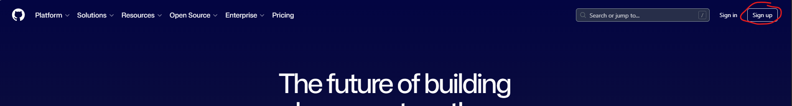{width="6.5in"
height="0.8708333333333333in"}

### Step 2:

Fill out your email, password, username, and country. Use the same email
and username as we did when we first installed Git on our computer or
you will have to update the config options in Git. Then select "Create
Account". I would suggest choosing a username that is professional in
name, as you may use this account in the future for employers if you
decide you want to have an online portfolio of your work. You may be
prompted to go to your email to paste in the verification code.

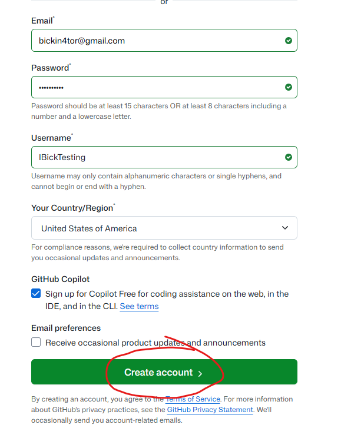{width="3.0in"
height="3.766839457567804in"}

### Step 3:

Sign in with your newly created credentials. You should see a green
notification telling you that your account was created successfully.

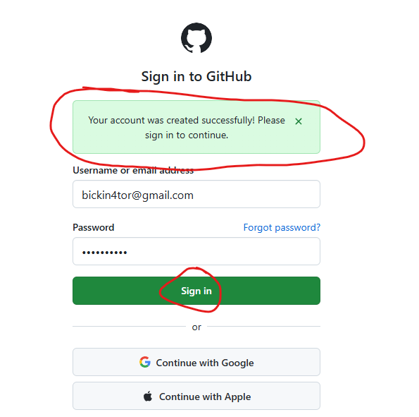{width="2.9895833333333335in"
height="2.2914359142607172in"}

## Creating a Remote Repository and Linking the Local Repository

### Step 1:

We will do a deeper dive into GitHub later, but for now we are going to
get our remote repository set up to connect to our local repository. To
do this we need to click on the create "+" button in the top right of
the screen and then select "New Repository".

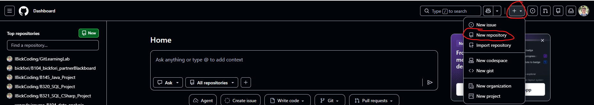{width="6.5in"
height="1.1541666666666666in"}

### Step 2:

Next, we need to configure the remote repository to meet our needs for
the local repository we created in a previous guide. Typically, you want
to name the remote repository the exact same name as the local
repository. We named the local one "GitPractice" so that's what we will
name the remote one. The description can be added to describe what the
repository is used for. Then, you want to change the visibility of the
repository to private so that only you can see the work you are doing.
Later, if you want other people to see your work you can change the
visibility to public. Then leave everything else set to no or off so
that we start with a completely empty repository.

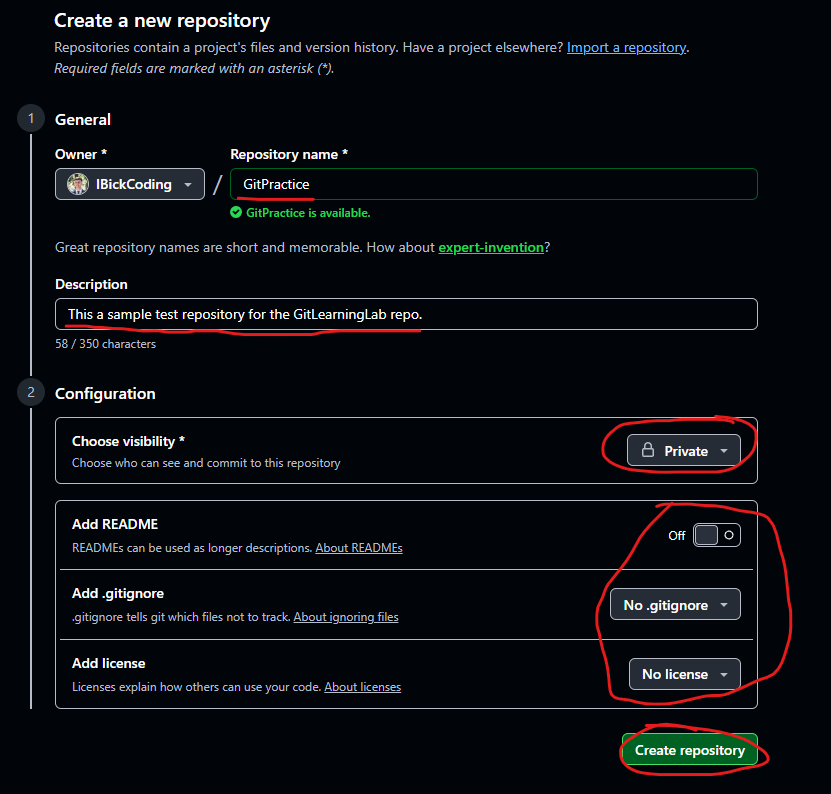{width="3.3252252843394574in"
height="3.1770833333333335in"}

### Step 3:

Next, we will connect our existing local repository to the remote
repository by copying the commands at the bottom of the remote
repository page we just created found under the section that says "...
or push an existing repository from the command line". We can press the
copy to clipboard button, then head to our practice repository on our
desktop. Open the folder and right click in the empty space and click on
the "Open Git Bash Here" option like we did before. In the command line
that opens up, you need to right click and press paste. Using the
shortcut to paste with "ctrl+v" does not work here.

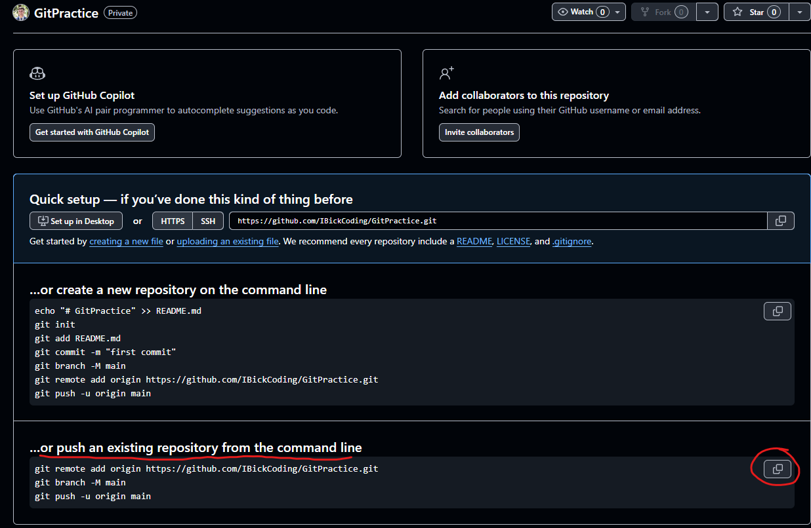{width="4.488451443569554in"
height="2.9270833333333335in"}

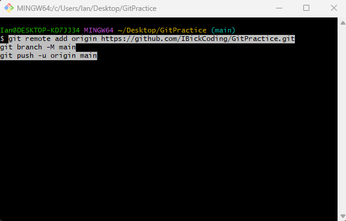{width="3.40625in"
height="2.1740758967629046in"}

### Step 4:

Once we do this, some magic will happen in the command line and if you
have followed everything in the guide properly, we can refresh our web
browser and see our work has been "pushed" to the remote repository.

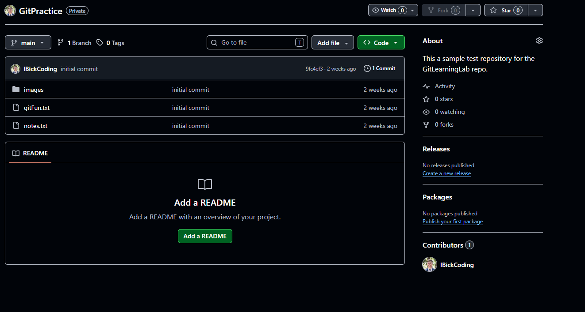{width="5.739583333333333in"
height="3.069695975503062in"}

------------------------------------------------------------------------

## Verify Link Between Local and Remote Repository

Although we have done a type of verification of this linkage by
refreshing the remote repository page, you can also check that the
linkage exists through the command line by running the command git
remote -v. The top link shows from which repository you will pull
changes from, and the bottom link is the repository that you will push
changes to. Yes, these can be different for more advanced workflows but
for now they should be the same.

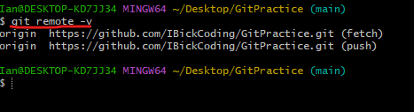{width="4.865262467191601in"
height="1.3231014873140858in"}

## Difference Between Local and Remote Repository

As explained before, it is important to understand that your local and
remote repository are two separate repositories. Git only synchronizes
the two repositories when you explicitly tell it to do so.

Typically, you will make your changes locally and then "push" your
changes to the remote repository. You can make changes from the remote
to the local repository, but this happens a lot less of the time if you
are the only one working in your repository. Later, when we are
collaborating with others you will need to pull changes from the remote
repository to your local repository more often.

This workflow is often coined as the "pull 🡪 add 🡪 commit 🡪 push"
workflow. Before you do any work in your local repository, you pull any
changes that have been made to the remote repository. If there is none,
Git will tell you that there are no changes. Otherwise, it will pull the
changes for you.

Next, you do your work in the local repository by editing, adding,
deleting files, etc. You then add those changes to your local staging
area using the command git add -A in the command line of your local
repository using Git Bash. This adds all the changes you have made to
the repository since your last commit.

Then, when we are done with the work that we set out to do, we commit
those changes by using the command git commit -m "Insert a commit
message". This command allows us to commit our changes while adding a
commit message that reflects the work we have done. It is best practice
to keep your commits to a single change at a time. Meaning, if I need to
write several features for an application, I will commit for each
feature. This allows us to ensure we can write meaningful messages that
are not too long for each commit. It also allows us to have many points
for restoring the repository to a working snapshot in the event we break
anything without losing too much work.

Finally, to tell GitHub we have made changes and want to update our
remote repository we use the command git push origin main. This tells
Git to push our work to the linked remote repository on the main branch
(we have just one branch named main at the moment).

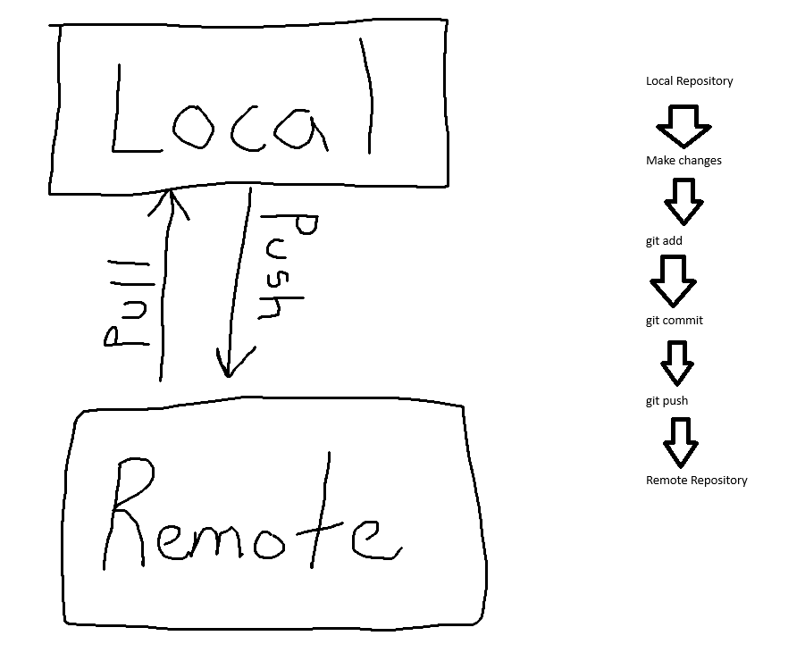{width="5.135416666666667in"
height="4.218064304461942in"}

## 

## Hands-On Example

This is a sample workflow so we can better understand what we have just
learned.

### Step 1:

First, make some changes to one of the existing files in the local
repository and then save it. I made changes to the gitFun.txt file and
then saved the changes.

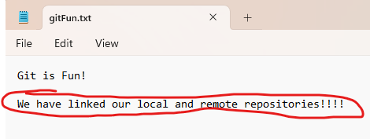{width="4.896516841644795in"
height="1.8440069991251093in"}

### Step 2:

Open a Git Bash terminal by right licking the empty space in our project
folder and clicking the "Open Git Bash Here" option. Next, we want to
add the changes to our staging area with the command git add -A. After
you add your work, it is a good time to look at your remote repository
to reinforce the fact that there has been no changes to the remoter
repository yet because we have not told Git to synchronize them through
a push.

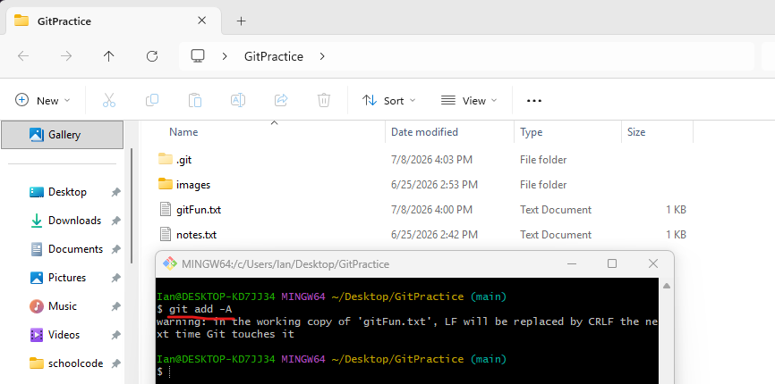{width="6.5in"
height="3.2270833333333333in"}

### 

### 

### Step 3:

We will then commit the changes that we have made with the command git
commit -m "reflected the linked repos in gitFun". This message is clear
and to the point with the changes we have made to the file. Once again,
check the remote repository to see that the changes (although committed
locally) have not been made to our remote repository because we have not
pushed them yet.

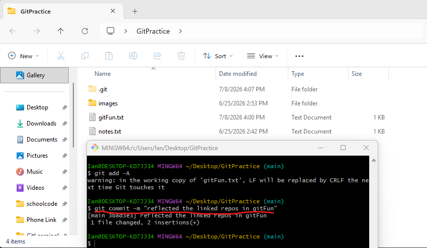{width="5.305147637795276in"
height="3.0833333333333335in"}

### Step 4:

We will now push the changes to our remote repository using the command
git push origin main. This serves as an explicit command to Git to
synchronize our remote repository to our local repository. Once we have
used this command, refresh the browser page once more to see that the
changes have now been reflected in the remote repository. You can see
the commit message next to the gitFun.txt file is different from the
initial commit message and instead reflects the message we used in the
commit step.

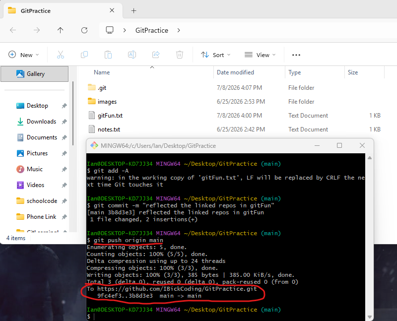{width="4.260416666666667in"
height="3.445657261592301in"}

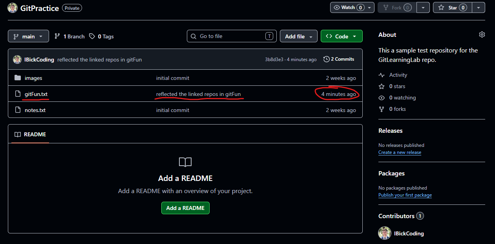{width="6.5in"
height="3.2111111111111112in"}

We can now access this file from anywhere in the world on any device as
long as we can sign in to our GitHub profile.

## Cloning a Repository

Although we could just download individual files or the whole repository
without cloning it, if we clone the repository instead, we can work in
that cloned repository from another device and still be able to make
changes and push them to the remote repository without having to
configure it again.

This is useful for when we want to work on a project from home on our
desktop and when we want to work on it outside of our home on our
laptop. If we were doing this on another device, you would need to
install Git again and configure it with your email and username again,
but you would then be able to work on these files as if you were on the
computer where you first made them.

I will show you the process of cloning a repository, but I am doing it
from the same device and just making a copy of the repository on my home
computer. To do this, I need to be on the remote repository webpage and
click on the green "Code" dropdown button. I then want to press the copy
to clipboard button for the link to this repository.

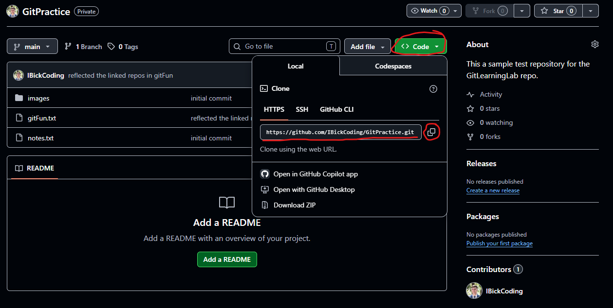{width="6.5in"
height="3.2729166666666667in"}

I then want to right click on an empty space on my desktop and use the
"Open Git Bash Here" option. I will then use the command git clone
followed by a space and the link I copied on the webpage. Keep in mind
that the "ctrl+v" shortcut does not work, you need to right-click and
select paste in the command line. If you do this on the same device as
the one where you created the local repository and you try to do this in
the file location as the local repository, you will get a fatal error
where it cannot clone the repository like the command terminal in the
left of the below picture. You can remedy this by making a temporary
folder and opening a Git Bash terminal there. Then you use the same
command, and it should clone into that file path as it is different.

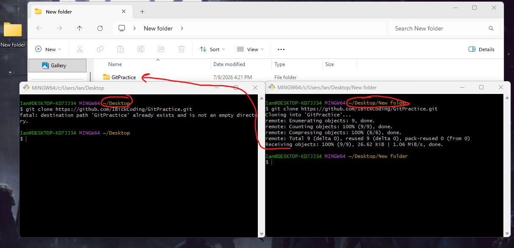{width="6.5in"
height="3.1430555555555557in"}

You can check the repository if you'd like, and you will see that the
files are exactly the same as they are in the current state of the
remote repository. Furthermore, you can make changes from this cloned
repository and push them to the remote repository, and they will reflect
in the remote repository.

You can then pull those changes into the first local repository if you
so choose by using the command git pull origin main.
