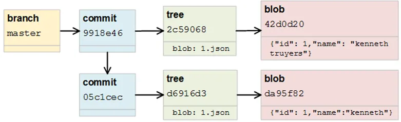
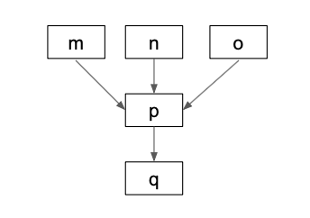
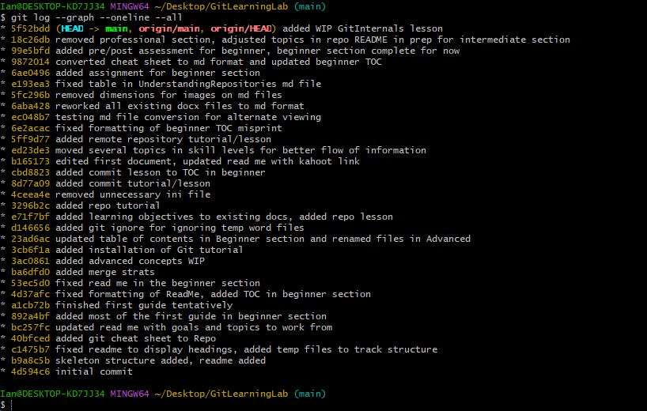
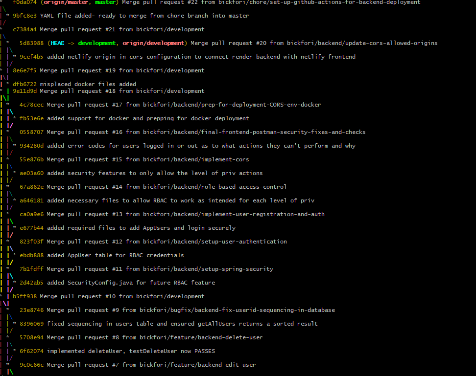

# Learning Objectives

At the end of this guide, learners will be able to:

- Explain how Git is fundamentally different from other version control
  systems.

- Describe Git as a content-addressable filesystem.

- Explain the difference between storing snapshots vs storing diffs
  (deltas).

- Identify the purpose of the Git Object Database.

- Describe how Git-managed files, directories, and commits are stored as
  objects.

- Explain the roles of blob, tree, and commit objects.

- Understand how each hash acts as a unique identifier to Git objects.

- Describe how commits form Directed Acyclic Graphs (DAGs).

- Explain parent-child relationships between commits.

- Interpret commit history using graphical commit visualizations.

- Build a mental model of how Git internally represents a repository.

------------------------------------------------------------------------

## Introduction

Most people learn Git by memorizing commands rather than understanding
how Git stores information. Although this approach is good enough to get
started, abstracting how Git works makes its commands confusing and
unpredictable. Once you learn Git's internal model, commands become much
easier to understand because you know what they are doing behind the
curtain.

In the Beginner section, many of Git's internal details were
intentionally abstracted so you could focus on learning how to use Git
with the basic workflow. However, in this section, we will begin to
start peeling back the abstractions and explore how Git really works
under the hood.

## Git vs Traditional Version Control Systems

Git usually stores snapshots of your project by storing references to
files that make up that snapshot, rather than a list of changes to files
like many traditional version control systems. If a file hasn't changed
within the project, Git simply points to the blob object containing the
contents of that file instead of duplicating the file each time the
overall project changes (more on blob objects later).

Git stores:

Snapshot 1 🡪 Snapshot 2 🡪 Snapshot 3

Many traditional version control systems store:

Version 1 🡪 Changes 1 🡪 Version 2 🡪 Changes 2 🡪 Version 3

This distinction is one of the key differences between how Git and other
traditional version control systems work.

------------------------------------------------------------------------

## Git as a Content-Addressable Filesystem

Internally, Git does not think in terms of files, instead Git thinks in
terms of objects.

As such, Git doesn't identify files by their filename like a human
would. Instead, Git identifies objects by their contents. Git takes the
contents of an object and hashes them, then that hash becomes the
object's unique identifier.

What is a hash? A hash is a deterministic, efficient, fixed length, one
way, and unique output of the original input. Hashes are generated by
passing input through a hashing algorithm. Deterministic means that when
you use a hashing function on an input, it produces the same output
every time. Efficient means that every time that you use the hashing
algorithm, it is quick for a computer to compute the output. Fixed
length means that regardless of the length of input, the output is the
same sized output every time. One-way means that the output is extremely
difficult to reverse back to the input. Unique means that ideally there
are no two inputs that produce the same output.

We can observe how Git hashes content by using a hashing algorithm such
as SHA-1. If we take a file named hello.txt that has the contents "Hello
World" and run this through the SHA1 algorithm, we get a hexadecimal
hash value of: 0a4d55a8d778e5022fab701977c5d840bbc486d0

If we then change the contents of hello.txt to instead be "Hello
World!", we get a hexadecimal hash value of:
2ef7bde608ce5404e97d5f042f95f89f1c232871.

You can observe this yourself by using an online hash conversion tool
such as <https://www.conversion-tool.com/sha1>.

What this illustrates is that by changing one character in the contents
of the file (adding the exclamation point), we get two completely
different hash values of the same size. This idea is the avalanche
effect and what makes hashing an efficient way for Git to identify
objects.

------------------------------------------------------------------------

## Understanding the Git Object Database

If you remember in the Beginner section, we mentioned that every time
that you initialized a Git repository, a hidden directory named ".git"
is created. Within this directory, Git stores the object database along
with other metadata that is critical to managing the repository.

Git stores information in this directory using several types of objects
including blob, commit, tree, and tag objects. These objects reference
each other in an interconnected structure that forms the underlying Git
database. References such as branches, tags, and HEAD point to these
objects and allow Git to locate different parts of the repository's
history.

Below is a visualized idea of how Git's database locates content within
the repository, it first checks the branch, which points to the commit,
which points to the tree, and finally which points to the blob.

## The Three Core Object Types Explained

There are three primary object types that we briefly went over in the
previous section regarding the Git Object Database. These objects are
blobs, trees, and commits (tags are objects but not a core object used
to represent repository snapshots).

Blob stands for Binary Large Object. Yes, blob is actually an acronym
and not some random funny name chosen by the Git development team. A
blob is simply the contents of a file; a blob does not store the
metadata about a file like the filename, permissions, or where in the
directory the file is located. Git then hashes the blob object and uses
the hash to identify the blob.

Tree objects organize blobs and subtrees and are equivalent to a folder
in a traditional filesystem. The tree stores the filenames, permissions,
references to individual blobs, and references to other trees. The
references are made through the blob or tree's hash value. The tree
itself is also hashed to identify the tree object. If you were to have a
directory with a path to a file named HelloWorld.txt be
GitPractice/Lesson1/src/HelloWorld.txt, the object relationship would
look like Lesson1 tree 🡪 src tree 🡪 HelloWorld.txt blob.

Commit objects store a pointer to an associated tree, a pointer to
parent commits (if applicable), author, committer, timestamp, and commit
message. A pointer to the associated tree means that the commit object
contains a pointer to the root tree object that represents the project
directory's snapshot. This tree then points to subtrees and blobs as
explained before. The pointer to parent commits means that Git is able
to determine the commit before this commit object in history. Author
information is who the user is that wrote the changes being committed
and committer information refers to the user who actually created the
commit object (yes, this can be different information and will be
covered later). The timestamps refer to the time that changes were
authored and when the commit object was created. Building off our
previous example our object relationship would now look similar to
Commit 1 🡪 Lesson1 tree 🡪 src tree 🡪 HelloWorld.txt blob.

## How Git Stores Data

Since we now have a pretty good understanding of the underlying objects
that are created when dealing with a Git repository, we can now go
through a proper example workflow and understand what Git is internally
doing.

Let's assume that we have a new repository and we want to start adding
files to that repository. First, we start with a README.md file, then we
commit this file to the repository. The underlying internals may look
like this:

*Create README.md (blob object created once added to the staging area) 🡪
Tree object created for the root of the project where the README was
created 🡪 Commit object created when we commit the README to the
repository.*

Next, we decide to make another commit to the repository after we add a
new file called GitIsFun.txt. The underlying internals may look like
this now:

*README.md unchanged but new file GitIsFun.txt is created (old blob
reused for the README.md file, but a new blob object is created for
GitIsFun.txt) 🡪 New Tree object created for the root project directory
where both these files exist 🡪 new commit object created for this second
commit, which points to the new root tree and to the previous commit
(parent commit).*

------------------------------------------------------------------------

## The Directed Acyclic Graph (DAG)

This sounds a lot more complex than it really is. A DAG is the
underlying graph structure that Git uses to represent the history of a
repository. When you break down the phrase "Directed Acyclic Graph", the
definition of what it is writes itself.

Directed means that the graph goes in one direction and not both ways.
In the case of the Git Object Database, this further means that commits
point backward, not forward. New commits point to the previous commit,
rather than the previous commit pointing to the new commit. This means
that "children" point to the parents, or in other words the newest nodes
point to the node that precedes it.

Acyclic means that no node can point to itself or have a path in which a
node is eventually able to get back to itself. It is a fancy word for
"no loops".

A graph just means that history can be visually represented by nodes and
links. Nodes are specific objects; links are the pointers or references
to another node that connects two nodes together.

The development team of Git chose this design because it makes Git
efficient at being able to track the history of a repository. Every
commit knows its parent, so Git can efficiently traverse the history of
the repository by following the parent references at each stage of the
repository.

Using the image above, we can solidify our understanding of a DAG. Think
of the letters m, n, o, p, and q as commits forming a repository's
history. Commits m, n, and o are the most recent commits. They are not
children of one another. This would represent a repository where a
developer is experimenting with different feature iterations, in turn
they have created 3 commits that branch from the p commit but are
independent of each other. They are all children of the parent commit p.
Commit p has commit q as its parent, where the history ends. For this
example, q represents the repository's initial (root) commit. Notice
that each commit points to the one before it, going backwards in time
and without creating any loops. This is a DAG in the context of a
repository's history.

------------------------------------------------------------------------

## Commit Ancestry

One of the most powerful features of Git's object model is that every
commit knows where it came from, or in other words, every commit knows
of its parent commit. This relationship among commits is known as
*commit ancestry*.

A commit does not store its own complete history of the repository, but
it instead stores a reference to its parent commit(s). By following
these parent references backward, Git can reconstruct the entire history
of a repository.

Notice how in the previous section I mentioned parent commit(s). This is
because any child commit may have one or more parent commits. When
multiple parent commits exist to one child commit, this is known as a
merge commit. A merge commit is simply taking two different commits and
joining them together to form a single commit that contains the changes
of both parent commits. We will go over this in more detail later, but
this can work with no issues or cause a merge conflict if two commits
have different overlapping content.

To be able to make a merge commit, Git must identify a merge base. If we
wanted to use the same image as we did before, and we wanted to merge
the commits m, n, and o, Git would have to identify where the commits
branch from each other as the merge base. In this case, commit p, being
the common ancestor of the three commits, would be the merge base. Git
would then see what changes were made from commit p to commit m, from
commit p to commit n, and from commit p to commit o. If there are no
overlapping changes, Git could merge all 3 commits into a singular
commit that we will name commit l. If it cannot merge the 3 commits due
to overlap, we will have a merge conflict. There are many ways to deal
with a merge conflict, but for simplicity's sake you can deal with a
merge conflict by manually inspecting the overlapping changes and choose
which overlapping content to keep and which to discard.

Without commit ancestry, Git would need to compare every file in every
version of the repository to determine how branches relate.

------------------------------------------------------------------------

## Basics of Rebasing

Building off what we learned from the previous section, you can think of
a rebase as essentially taking the child commits from one branch of a
merge base and appending them as new children commits to another branch
of the merge base.

     C 🡨 E

   /

A 🡨 B

   \\

     D 🡨 F

In the above diagram, we have a root named commit a, which has one child
commit B. Commit B has branched to commits C and D, and each of those
commits have their own children of E and F respectively.

We could choose to rebase this structure rather than merging D and F
into one child commit. To do this, we would choose a new base such as
commit D. The branch containing commits D and F remain unchanged, and
append commits C and E as child commits stemming from the new parent
commit F. The new commit history would look like:

A 🡨 B 🡨 D 🡨 F 🡨 C' 🡨 E'.

The ' just denotes that commits C and E in this history would have
different hash identifiers from the original C and E commits. You are
not technically appending the old commits but instead recreating new
commit objects with the same changes but have a reference to a new
parent, thus a new hash value.

------------------------------------------------------------------------

## Visualizing Commit Graphs in Git Bash

To be able to visualize the commit graph using Git bash, we can use the
command \`git log \--graph \--oneline \--all\` where the argument
\--graph displays an ASCII graph of our commit history, \--oneline
condenses each commit to one line rather than taking up several lines
per commit, and \--all shows all commits from all branches (not just the
one branch that you may be working in).

The above image shows the commit history of this repository at the time
of writing this guide. If there were any branches, Git Bash would denote
that using "\|\\" to show where a branch diverged from the merge base
and then "\|/" to show where the merge eventually comes back together.
In this case, there are no branches to this repository and instead we
have a linear history of all the commits, a portion of their identifier
hash, and the commit message associated with the commit.

The above image is an example of another Git repository that is more
complex, where branches are constantly being pulled out from the main
branch and then merged back into the main branch.

------------------------------------------------------------------------

## Updating the Mental Model and Putting It All Together

This has been a pretty technical lesson, and if you have reached the end
understanding all the covered concepts, give yourself a pat on the back.
Let's take everything that we have learned in this lesson and update our
mental model from what we already to now.

Before, the mental model was Working Directory 🡪 Staging Area 🡪 Commit.
But now we have a better understanding of the commits and the internal
actions that occur to make this happen and can elaborate on this model a
little more.

Working Directory 🡪 git add 🡪 Staging area 🡪 blob object created 🡪 git
commit 🡪 tree object created 🡪 Commit object created 🡪 Commit History
(DAG).
