# Learning Objectives

By the end of this guide, learners will be able to:

1.  Explain how Git communicates with remote repositories.

2.  Differentiate between cloning, forking, and creating a repository.

3.  Describe the purpose of the \`origin\` and \`upstream\` remotes.

4.  Explain the relationship between local and remote-tracking branches.

5.  Explain why pulling before pushing helps prevent conflicts.

6.  Explain the purpose of the fetch, pull, and push commands.

7.  Describe how \`git pull\` combines fetching and merging.

8.  Explain how to review changes before committing or pushing.

9.  Explain good commit etiquette when collaborating with others.

10. Explain the mental model of how local repositories synchronize with
    remote repositories.

------------------------------------------------------------------------

## Introduction

In the beginner section, we learned that local repositories exist on
your own computer and that remote repositories are stored on another
system. If we want to keep the local and remote repositories
synchronized for a project, we must be able to exchange repository
history and information between them. Furthermore, if we have teammates
that are also working on the same repository, they need to be able to
access the changes that we make, just as we need to be able to access
theirs.

------------------------------------------------------------------------

## How Git Knows Where to Synchronize

In the introduction, we discussed that we need to be able to synchronize
a local and remote repository. But how does Git actually know where this
remote repository is located so that it can synchronize with it?

The answer is through *remotes*. A remote is almost like a bookmark that
stores the location of another Git repository. Instead of you having to
type out the URL to the location of your remote repository every time
you push changes, Git stores this information under a human-readable
name.

For example, when you clone a repository from GitHub (create a local
repository containing the history of a remote repository), Git
automatically creates a remote named origin. This remote points to the
repository's URL that you cloned and stores this information within the
\`.git/config\` file in your repository.

Below is a picture of the \`.git/config\` file for this repository,
showing the URL for the remote repository saved as "origin".

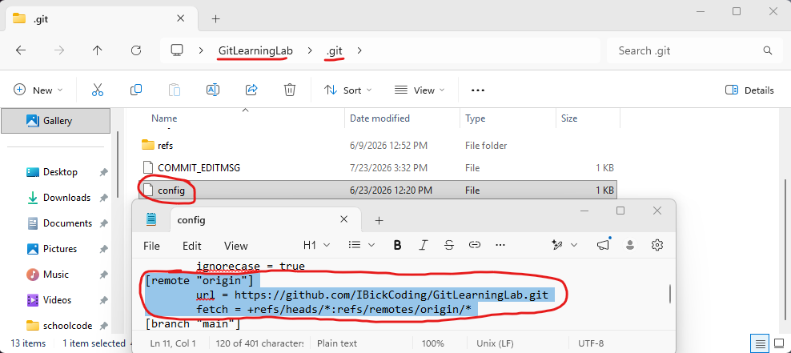

You can also see all remotes that exist for a repository by using the
command \`git remote -v\`. The -v flag in this command allows us to see
the URLs associated with each remote. The reason this is important is
because repositories can have multiple remotes. For example, when you
are contributing to an open-source project, it is common to have an
\`origin\` remote pointing to your own fork of a repository and an
\`upstream\` remote pointing to the original project repository. We will
go into more detail on this later.

------------------------------------------------------------------------

## Clone, Fork, or Creating a Repository

When using Git, there are several ways to obtain or create a repository.
You may clone an existing repository, fork an existing repository, or
create a new repository from scratch depending on your goal.

### Clone

Cloning a repository creates a local copy of an existing Git repository,
including its files, commit history, branches, and remote configuration.
If you own this repository or have permission to write to the remote
repository, you can push your changes to the remote repository. However,
if you do not have permission to write to the remote repository, cloning
a repository will not allow you to make changes to the remote
repository. Instead, this cloned repository becomes its own separate
repository. It shares the repository history of the remote repository up
to this point in time, but you cannot push changes to the remote
repository.

You can clone a repository by opening a Git Bash terminal and using the
command \`git clone {insert clone URL}\`. You can get this clone URL by
going to a repository that you want to clone from on GitHub, clicking on
the green "code" button on the main page of the repository, and
selecting the HTTPS option.

You can also clone a repository using SSH. This requires that you have
an SSH key configured on your computer and that the corresponding public
key has been added to your GitHub account.

Below is an example of me cloning this repository from GitHub to my
computer, using the URL method.

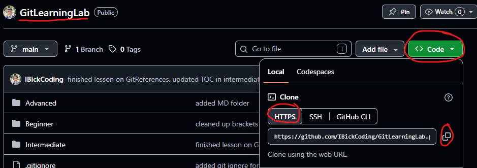

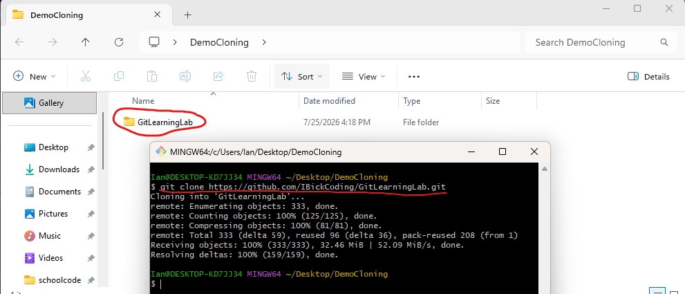

### 

### Fork

Forking creates a copy of a repository on a Git hosting platform such as
GitHub under your own account. Forking occurs on GitHub and cloning
occurs on your computer. Since forking is done on GitHub, there are no
commands required for forking a repository. Instead, we will use the
GitHub interface from the browser.

Forking is typically used when you do not own a repository and do not
have permission to push changes, but you want to contribute to the
project. You would fork the repository, clone that forked repository to
your computer, and then make your contributions to the project. But how
do we keep up to date with the original repository's changes on this
forked repository?

This is where adding an additional remote to your repository comes in
handy. You can add an \`upstream\` remote by using the command \`git
remote add upstream {insert URL of the original repository}\`. This
would leave us with two remotes:

origin 🡪 Your forked repository.

upstream 🡪 Original project repository.

After adding an upstream remote, you can fetch changes to your local
repository from the upstream repository by using the command \`git fetch
upstream {branch name}\`. This downloads the latest commits from the
upstream remote on the branch name you provided and updates your local
remote-tracking branch. Fetching does not automatically merge these
changes into the current branch. It only updates your local copy of the
upstream branch, allowing you to review and integrate changes made to
the original repository when you are ready. But how do we submit our
changes to the original project's repository?

This is also done on GitHub. Once your forked repository has all the
contributions pushed to it from your local clone of the repository, you
would then open a pull request on the original project repository's
page. You will write a description of the changes or contributions that
you made, and then the owner of the original repository will review your
pull request. If they approve of your contributions, they will merge
your pull request into the original repository, or they could decline
the pull request if they do not approve of your contributions.

Below is a series of images that show the process of forking a
repository, making contributions, making a pull request, and merging a
pull request.

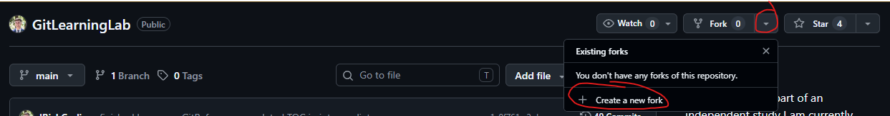

First, we will click on the dropdown menu for "Fork" and then the
"Create a new fork" option.

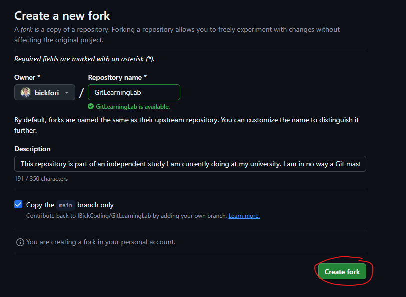

Next, we will keep all the settings default and press the "Create fork"
button. After a few seconds, we will be redirected to the forked
repository.

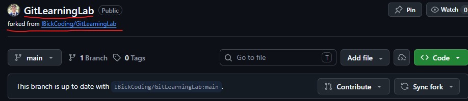

We can confirm this is a forked repository by looking at the name of
this repository and see that it is a forked repository from the original
project.

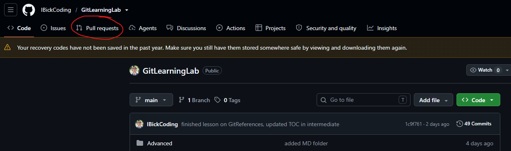

We will now go to the original project repository and click on the "pull
requests" option on the top of the page after making our contributions.
For this example, I created a new file called TempForkExample.txt with
one line of text that I will be making a pull request for. I made this
file within the GitHub page for the forked repository, otherwise we
would need to clone the repository to this computer and push our changes
up to the forked repository.

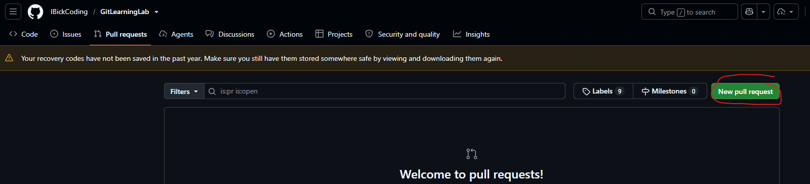

We will then click on "New pull request".

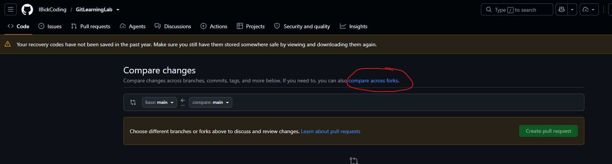

Click on the compare across forks option as GitHub currently does not
know that you want to compare a fork to the original repository and
instead is trying to compare branches within the same repository.

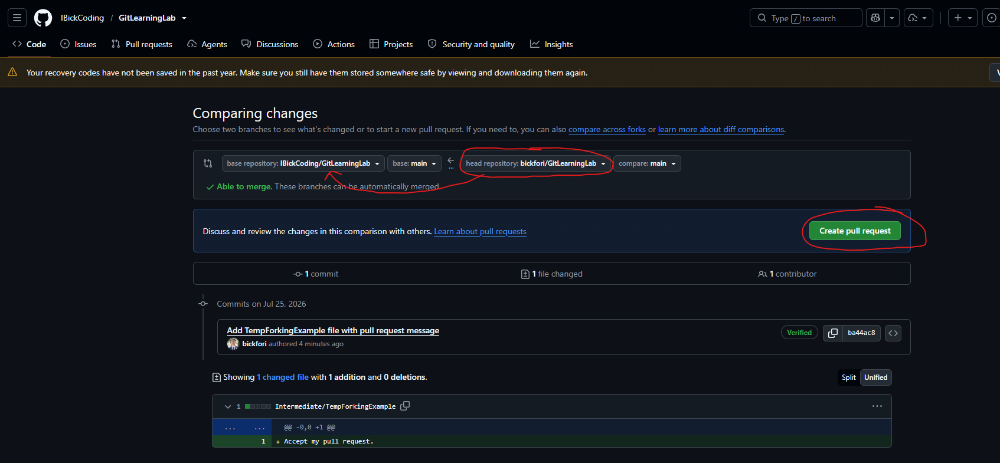

We then will change the head repository to the forked repository, make
sure we are comparing the correct branch in each repository to each
other (in this case we just have one branch "main" to compare to one
another). We can then see the summary of the commits, files changes, and
the contributor to those changes below. If we are satisfied with the
pull request, we will click the "Create pull request" button.

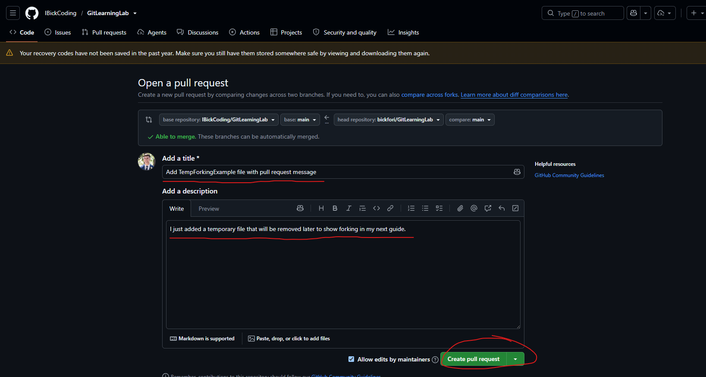

We will then add an appropriate title, an appropriate description of all
changes made, and then click the "Create pull request" button.

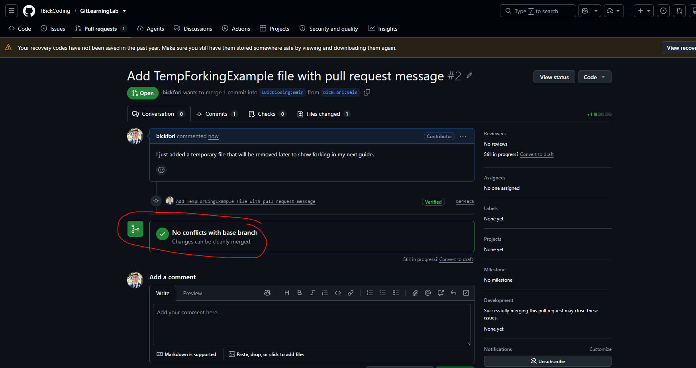

Once we create the pull request, we can see that there are no conflicts
with the changes that we have made. Now it is up to the owner to either
merge the pull request or close it if they do not want to merge the
contributions that you have made.

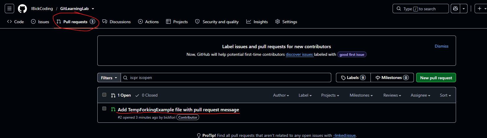

Now that I am signed back into the account that owns this repository, I
can see the pull request that we made. Note: We would not be able to
select the pull request and merge it if we were not the owners of this
repository. We could still view open pull requests, but we could not
merge them.

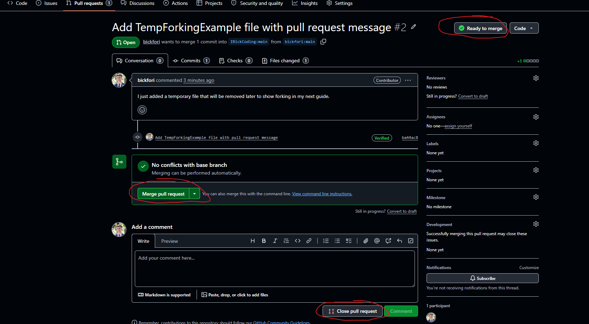

Once we click on the pull request, we can see that the pull request is
ready to be merged as there are no merge conflicts. If there were merge
conflicts, we would see in the top right that the pull request was not
ready to merge, the conflicts section would tell us where there are
conflicts, we would have to manually resolve the conflicts, and only
then could we merge the pull request. Alternatively, we can also select
the "close pull request" option at the bottom if we do not approve of
the contribution. We will select this as I have no need for this
contribution.

### Creating a Repository from Scratch

Creating a new repository on your local computer is done by going into
an existing directory, opening a Git Bash terminal, and running the
command \`git init\`. This will then take the current directory and
transform it into a local repository by creating a \`.git\` directory.

You can also create a new repository on GitHub by clicking on your
avatar on the homepage, click the "Repositories" option from the
dropdown menu, and then click the "New" green button. Afterwards, you
can adjust the settings to what you want and click on the "Create
repository" option.

If you need to connect an existing local repository to a new remote
repository you would use the command \`git remote add origin
https://github.com/{USERNAME}/{REPOSITORY}.git\` from the Git Bash
terminal from within your repository on your local computer.

If a repository already exists on GitHub and you need to create a local
copy, you can use the \`git clone\` command discussed in the Clone
section.

------------------------------------------------------------------------

## Remote-Tracking Branches

In the Git References guide, we learned that branches are references
that point to commits within a repository's history. When we have a
local repository that is connected to a remote repository on a platform
like GitHub, we need to have a way locally to keep track of the remote
repository's commit history as well. To do this, we have something
called remote-tracking branches. These are local references that store
the last known state of a branch from a remote repository the last time
Git communicated with that remote.

It is an important distinction to understand that a remote-tracking
branch is not the actual branch on the remote repository, but that it is
instead Git's local record of where the remote branch was last seen in
the commit history.

For example, if we have a local repository that is connected to a GitHub
repository through a remote named \`origin\`, our references may look
like:

HEAD 🡪 main 🡪 Commit C (local branch)

origin/main 🡪 Commit C (remote-tracking branch)

This would indicate to us that our local repository HEAD is pointing to
\`main\` and \`main\` is pointing to commit C. Likewise, our
remote-tracking branch named \`origin/main\` is pointing to commit C.
However, this does not guarantee that the actual remote repository is
still at commit C. The remote repository may have advanced since the
last time Git had communicated with it.

Perhaps we have some teammates that are updating the GitHub repository,
but we have not yet communicated with the remote repository to retrieve
those changes. In this example, our references may look the same but the
remote repository's \`main\` branch may be pointing to commit F.

HEAD 🡪 main 🡪 Commit C (local reference)

origin/main 🡪 Commit C (local reference)

main 🡪 commit F (remote repository's reference)

Our local repository would have no way of knowing that the \`main\`
branch in the remote repository is pointing to a commit that is three
commits ahead of our local repository.

Until we communicate with the remote repository, our \`origin/main\`
reference is considered a "stale reference" as it no longer represents
the current state of the remote branch. If only there was a command that
would update the stored reference to the remote-tracking branch...

------------------------------------------------------------------------

## Fetch

Fetch is the command we use to communicate with a remote repository and
update our local remote-tracking branch with the latest information from
the remote repository. If we use the command \`git fetch\`, Git will
update its local reference to the remote repository through the
remote-tracking branch.

If we go back to the last example, we had these references:

HEAD 🡪 main 🡪 Commit C (local reference)

origin/main 🡪 Commit C (local reference)

main 🡪 commit F (remote repository's reference)

However, if we used the command \`git fetch\`, our references would
instead look like:

HEAD 🡪 main 🡪 Commit C (local reference)

origin/main 🡪 Commit F (local reference)

main 🡪 commit F (remote repository's reference)

This doesn't seem like it did a whole lot, did it? Well actually it did,
because now Git is tracking that the remote repository is ahead of the
local repository, but it did not merge any of those changes with our
working branch.

Since fetch only updates remote-tracking branches, it is considered a
safe option. It allows us to inspect the incoming changes from the
repository before deciding how to integrate them.

What if we haven't done any work since the last time Git communicated
with the remote repository, but we wanted the work that our teammates
have since contributed to the remote repository in our own local
repository?

------------------------------------------------------------------------

## Pull

This is where the \`git pull\` command comes in handy. This command will
combine the function of \`git fetch\` and \`git merge\`.

First, Git will retrieve the latest changes from the remote repository,
and it will update the remote-tracking branch. Then, Git merges those
changes into the current local branch. If we have not made any new
commits to our local branch since the last time we synchronized with the
remote repository, the merge will occur smoothly without conflict.

Even if we have made commits since the last time we synchronized with
the remote repository, as long as those changes do not conflict with any
of the changes that are being pulled from the remote repository, the
merge should occur without any issues.

If we go back to the original example, we had these references:

HEAD 🡪 main 🡪 Commit C (local reference)

origin/main 🡪 Commit C (local reference)

main 🡪 commit F (remote repository's reference)

If we use the \`git pull\` command, our references will look like:

HEAD 🡪 main 🡪 Commit F (local reference)

origin/main 🡪 Commit F (local reference)

main 🡪 commit F (remote repository's reference)

As you can see, this time our local \`main\` branch reference is
updated. Now, our HEAD, local \`main\` branch, remote-tracking branch,
and remote repository \`main\` branch are all tracking the same commit
as the latest commit.

Fetch updated our knowledge of the last known commit in the remote
repository, but pull actually moves our local branch forward by
integrating those commits!

## Push

Since we have learned that \`git fetch\` and \`git pull\` allow us to
retrieve changes from a remote repository, how do we take our changes
and send them to the remote repository so that our teammates can access
them?

This is where the \`git push\` command comes in. The \`git push\`
command allows us to send commits from our local repository to the
remote repository. It then updates the remote repository's branch
reference to point to those new commits we have pushed.

In this example, we are assuming that our local branch is ahead of the
remote repository by three commits:

HEAD 🡪 main 🡪 Commit F (local reference)

origin/main 🡪 Commit C (local reference)

main 🡪 commit C (remote repository's reference)

If we use the command \`git push\`, our references would instead look
like this:

HEAD 🡪 main 🡪 Commit F (local reference)

origin/main 🡪 Commit F (local reference)

main 🡪 commit F (remote repository's reference)

This time instead of updating our local \`main\` branch with the changes
from the remote \`main\` branch, we are instead updating our remote
\`main\` branch with the changes from our local \`main\` branch.
Additionally, our remote-tracking branch will also update to reflect the
new reference to commit F as Git knows that the remote repository's main
branch now points to Commit F.

------------------------------------------------------------------------

## Handling Rejected Pushes

Since pushing changes modify a SHARED remote branch, Git applies certain
safeguards to prevent accidentally overwriting other people's work. If
the remote repository contains commits that are not present in our local
branch at the time of the push, Git will reject the push and require us
to first retrieve and integrate changes before attempting to push again.

For example, if a teammate pushed commit F to the remote repository
while we were working locally, our references may look something like
this:

HEAD 🡪 main 🡪 Commit E (local reference)

origin/main 🡪 Commit C (local reference)

main 🡪 commit F (remote repository's reference)

If we attempted to push Commit E, Git would reject the push because the
remote repository has commits that our local repository does not
contain. This prevents us from accidentally removing our teammates'
changes because the remote repository contains commits that are not part
of our local history.

In this situation, we may need to use \`git fetch\` and \`git merge\` to
manually integrate their changes before attempting to push again.

------------------------------------------------------------------------

## Basic Collaboration Workflow

Now that we understand the nuance of how Git communicates with remote
repositories and how Git internally works, let's put it all together to
form a basic collaboration workflow that you can start integrating into
your group projects.

### Step 1: Fetch or Pull Changes

A good habit when beginning work in a group project is to check whether
there have been any updates from your teammates in the remote
repository. You can do this one of two ways. The first way is to run a
\`git fetch\` first. This will allow you to review changes using \`git
log\` or another comparison command before integrating changes.

If you just want to integrate the changes from the remote repository and
you do not need to review them first, you can skip straight to using the
command \`git pull {remote} {branch}\`. This allows you to just skip
straight to integrating the changes from the remote repository into your
current branch. This is ok as long as your local changes do not conflict
with the changes being integrated from the remote repository.

For many small projects/teams, using \`git pull\` directly is perfectly
acceptable. Remember, \`git pull\` just combines the \`git fetch\` and
\`git merge\` commands. Using \`git fetch\` just gives you more control
because it allows you to inspect changes before integrating them, which
can be handy in projects/teams that are large or complex.

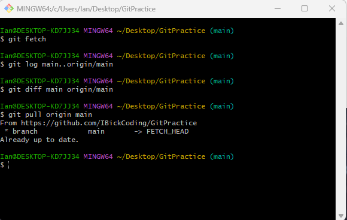

If we look at the above image, I attempted to fetch updates from the
remote repository. There were no new commits, so there was no output. If
there were new commits and you wanted to see the commits that are not in
your local branch yet, you can use the command \`git log
main..origin/main\` or \`git diff main origin/main\`. Lastly, I used the
command \`git pull origin main\`. If there were new commits in the
remote repository, this would have integrated those commits into our
local branch. Notice that because there were no new commits, Git will
explicitly tell you that your branch is up to date.

### Step 2: Complete Your Work

The next step is simple; you are going to complete any work that you
need to do during your work session. It is good practice to keep your
commit scope to one logical and focused change. This way, when you write
your commit message you can keep a logical history of everything that
has changed in the repository. When you start lumping a large number of
changes into one commit, you make it difficult to audit your work and
see when certain features have been added. But before we can commit, we
first need to add your work to the staging area.

### Step 3: Add Work to Staging Area

When you are trying to add work to the staging area, you have different
options to choose from. You could add all of your changes by using the
command \`git add -A\`, add the work from the current directory (and its
sub-directories) by using the command \`git add .\`, or only add the
work from one file by using the command \`git add {filename}\`. What you
need to use is up to you, but most of the time \`git add -A\` is
sufficient for smaller and simpler projects.

To review the current state of your working directory and staging area,
you can optionally run the command \`git status\`. This also makes the
\`git add -A\` command safer, as any changes that you do not intend to
pushed will be displayed for you to see. It will also show you any
unstaged changes if you were manually adding specific changes.

### Step 4: Commit Changes

Create a commit with a message that describes the relevant changes that
were made. This commit message should be short but express what has
changed. A good rule of thumb for commit scope is that if your commit
message is vague or very broad, your commit may have more changes than
you should.

You can write a commit with a message by using the command \`git commit
-m "{insert message}"\`. Remember, good commit messages make it easier
for you and your teammates to understand the relevant changes made in
this commit.

You can optionally return to step 2 and continue this process until you
are ready to push all your commits at once.

### Step 5: Push Your Changes

Once you are ready to push your commit(s) to the remote repository, you
will use the command \`git push {remote} {branch}\`. If the remote
branch has not changed in the time it took you to push your changes,
this process should occur quickly and with no conflicts.

A good rule of thumb when you first start working on group projects and
to avoid conflicts, is to try and work on different files from your
partners if you are working at the same time. This will reduce the
chance of conflicts with someone else's work. In more complex projects,
or projects that revolve around a limited number of files, this may not
be possible and will require conflict resolution or better
communication.

### Basic Workflow

This workflow can be simplified to:

Pull 🡪 Add 🡪 Commit 🡪 Push

This workflow should become habit and is key to learning more advanced
workflows later. Following this process helps reduce mistakes, keeps
your local repository synchronized with the rest of the team, and makes
collaboration significantly smoother.

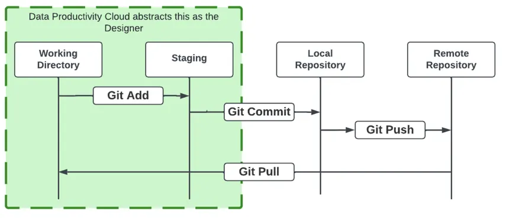

------------------------------------------------------------------------

## Merge Conflicts

When collaborating with others, it is possible that two people make
changes to the same part of a file at the same time. When this occurs,
Git does not know which changes should be kept. Instead of guessing and
making somebody lose their work, Git stops the merge process and asks
you to resolve the conflict manually.

The merge conflict can occur when you are using the commands \`git
pull\` or \`git merge\`. When this happens, Git will tell you which
files contain conflicts. You can use the command \`git status\` to view
the current state of the repository and see which files need to be
resolved. Inside the conflicted files, Git will show you where the
conflict is occurring.

A conflict will look something like this:

\<\<\<\<\<\<\< HEAD

Your local changes that are conflicting will appear here

=======

Changes from the remote repository will appear here

\>\>\>\>\>\>\> origin/main (or whatever remote/branch you are using to
pull from)

To be able to resolve this conflict, you will need to delete the special
markings \<\<\<\<\<\<\< HEAD, =======, and \>\>\>\>\>\>\> origin/main.
Then, you would select the changes that should exist in this section
(preferably after communicating with the team member whose work is
conflicting with yours) and delete the work that no longer needs to be
there. Alternatively, you can choose to rewrite the section to include
both or none of the work that is conflicting. This entirely depends on
the situation and the project.

After you resolve this conflict, ensure that there are no other
conflicts within this file or other files. You can easily check for this
by using the command \`git status\` again to see the current state of
the working directory. You can then stage this file and any other file
that had conflicts you resolved using the command \`git add {filename}\`
and then \`git commit -m "{insert commit message}"\`. In the commit
message, you can optionally describe the conflict that was resolved.

You then need to push your resolved changes to the remote repository
using \`git push {remote} {branch}\`.
