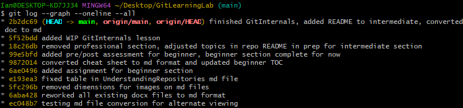
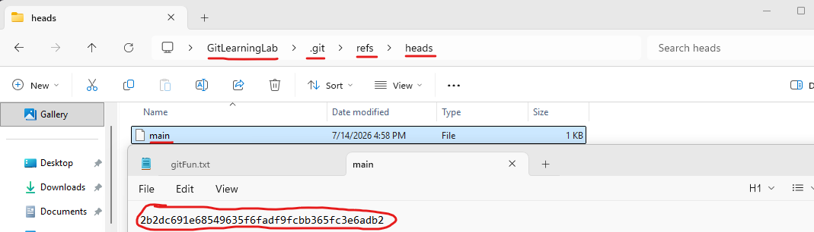
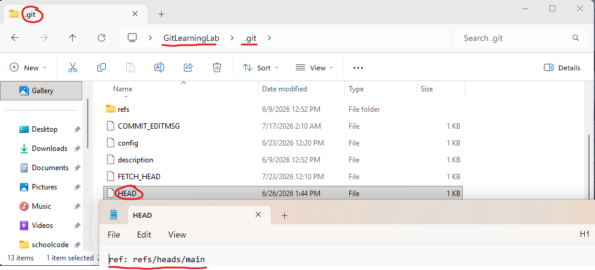

# Learning Objectives

By the end of this guide, learners will be able to:

1.  Explain how Git uses references to identify and locate objects
    within a repository.

2.  Describe what HEAD represents and how Git uses it to track the
    current location in history.

3.  Differentiate between symbolic and direct references.

4.  Describe how branches function as moveable pointers to commits.

5.  Explain how creating a branch does not duplicate repository data.

6.  Differentiate between lightweight tags and annotated tags.

7.  Explain how tags are used to mark specific points in Git history.

8.  Navigate between commits using Git references.

9.  Explain what a detached HEAD state is.

10. Explain what may cause a detached HEAD state.

11. Identify the risks and limitations of working from a detached HEAD
    state.

12. Safely create, preserve, and recover work created while in a
    detached HEAD state.

13. Build a stronger mental model of Git as a system of objects and
    references.

------------------------------------------------------------------------

## Introduction

As we learned in the previous guide, Git is built on the foundation of
pointers and objects. A git repository has three core objects: blobs,
trees, and commits. These three objects work together to represent file
contents, directories, and snapshots of the repository.

Commits then use pointers to form a Directed Acyclic Graph (DAG), which
represents the complete history of a repository. Since each commit knows
its own parent commit, Git is able to travel backwards through the
history of the project.

But how does Git know which point in the repository's history we are
currently working from within that DAG? A Git repository may contain
hundreds to thousands of commits, so Git needs a way to know how to
identify a specific point in the commit history. The answer is
references!

------------------------------------------------------------------------

## What Are References?

A reference is simply a human-readable name that points to a Git object.
We can observe this in a repository that has one branch named "main".
The reference "main" stores the hash identifier of the latest commit
object in that line of development.

An important distinction is that "main" is not the commit, but rather a
pointer to the commit. Let's look at a real example.

The above image is the commit history of this repository that I am
currently working on. On the first line after the command \`git log
\--graph \--oneline \--all\` we can see the latest commit: 2b2dc69. Next
to it, we see something called HEAD 🡪 main. We will go over what HEAD is
very soon, but for now let's focus on the part that says main. The
reference "main" points to the commit 2b2dc69, as it is the latest
commit on this line of development. If I were to stop this guide here,
and make another commit we would see the reference for main shift to the
new commit's hash identifier.

As previously mentioned, references store the hash identifier of the Git
object they point to. Where do we store these references? We store
references in the "refs" directory, which is found in the hidden
\`.git\` directory that we have covered before.

Inside this directory, we have several other sub-directories including
heads and tags. The "heads" directory contains references to local
branches and the "tags" directory stores references to tags. More on
this later.

------------------------------------------------------------------------

## Branches Are Just Pointers

A common misbelief is that each branch is a separate copy of the files
from a repository. Instead, branches are just pointers to a commit and
do not create copies of the files every time you create a new branch.
Creating a new branch just creates a new label or reference to a given
commit.

For instance, if we had a single branch named "main" that had a linear
repository history of A 🡨 B 🡨 C, the current reference that "main"
stores is the hash identifier of commit C. The workflow would look like:

A 🡨 B 🡨 C

"main" 🡪 C

Now, let's say we want to create an experimental branch named "feature"
where we can test new features that we want to add to "main", but only
when the feature is complete. We can create and switch to this branch
using the command \`git switch -c feature\`. With this command, we have
now created a new label or reference called "feature" that points to the
hash identifier of commit C and swapped to this branch. Both "main" and
"feature" are references to the same commit currently. The workflow
would look like:\
A 🡨 B 🡨 C

"main" 🡪 C

"feature" 🡪 C

Now let's pretend that we are working on that feature. It took us 3
commits worth of work to finish that darned feature. We will aptly name
those commits D, E, and F. Right now, the "feature" reference points to
the hash identifier of commit F and the "main" reference still points to
the hash identifier for commit C. The workflow would look like:

A 🡨 B 🡨 C 🡨 D 🡨 E 🡨 F

"main" 🡪 C

"feature" 🡪 F

If we have a working version of the feature and we want "main" to now
point to the same commit as the feature line of development, we will
merge the two branches at commit F.

This is called a fast-forward merge, because the two branches never
diverged. The "main" branch was behind the "feature" branch and now
fast-forwarded to the point in the repository's history where the
"feature" branch is, which would be commit F.

The reference "main" would now point to commit F, as would "feature". No
files were copied, no history would be duplicated, but only a new
pointer from "main" to the hash identifier for commit F. Finally, the
workflow would look like:

A 🡨 B 🡨 C 🡨 D 🡨 E 🡨 F

"main" 🡪 F

"feature" 🡪 F

Finally, as explained before you can actually see these references if
you open the .git/refs/heads directory, and look to see what is stored
in the files for both "main" and "feature". In this example, both files
opened in notepad would have the hash identifier of commit F. Below is
an image of this repository's \`.git/refs/heads/main\` file, which
contains the latest commit's hash identifier:

------------------------------------------------------------------------

## How Branches Move

Going back to a simpler workflow of a repository with a single branch
named "main", let's quickly go over another important behavior of Git.
If branches are pointers, who updates the pointer when new changes are
made? Well Git does of course!

Git updates the branch reference to point to the new commit
automatically whenever you commit new changes. The branch moves forward
to the newly created commit because the reference changes to the new
commit's hash identifier inside of the \`.git/refs/heads\` directory.

------------------------------------------------------------------------

## What is HEAD?

HEAD is the most important reference in Git. It tells Git where you are
currently working within the repository's commit history. Many Git
operations that create a commit, compare changes, switch branches, or
otherwise interact with the repository history use HEAD to determine
your current location in history.

Most of the time, HEAD does not point directly to a commit, although it
can. Typically, though, it points to the current branch and that current
branch then points to the latest commit within that line of development.
If you had a repository with a single branch named main and a commit
history of A 🡨 B 🡨 C, the references may look something like:

HEAD 🡪 main 🡪 Commit C

In this example, HEAD points to main as the current branch being worked
on and as we learned in the previous section, main is a reference to the
latest commit on that line of development. Since HEAD points to main,
whenever a new commit is created on the branch, Git automatically
updates the main reference to the newest commit. Consequently, since
HEAD points to main, HEAD automatically references the newest commit on
that branch through its reference to main.

You can see what HEAD is referencing by using the command we used prior
\`git log \--graph \--oneline \--all\`. In the output we can clearly see
the reference of HEAD 🡪 main. Additionally, we can also go to
\`.git/refs/heads\` in the repository's directory and see a file named
\`main\`, which has the commit's hash identifier that main currently is
referencing.

Although this is the most common behavior of HEAD, it is not always
attached to a branch. HEAD can point directly to a commit instead and
this is known as a detached HEAD state. We will cover this later in this
guide.

------------------------------------------------------------------------

## Symbolic References

In the last section, we learned that HEAD does not usually point
directly to a commit. Instead, HEAD points to another reference, usually
a branch, and that branch points to a commit. This relationship is known
as a symbolic reference because one reference points to another
reference rather than directly pointing to a Git object. For example, if
we have a repository with a branch named main, the reference chain would
look like:

HEAD 🡪 refs/heads/main 🡪 hash of commit B 🡪 Commit B.

In this example, HEAD is not directly pointing to Commit B but instead
pointing to the main branch. The main branch is then pointing to Commit
B using the hash identifier of Commit B stored in refs/heads/main.

We can observe this relationship by opening the \`.git/HEAD\` file.
Instead of containing a commit hash, this file contains the reference
path of the branch currently being used.

If we were to create another branch named \`development\` and switched
to that new branch, the HEAD file would be changed to reflect that HEAD
now points to the \`development\` branch rather than the main branch.
The file contents would now look like "ref: refs/heads/development".

However, symbolic references are not limited to just HEAD. Git uses
symbolic references internally whenever one reference needs to point to
another reference instead of directly pointing to a Git object.

------------------------------------------------------------------------

## Direct References

In contrast to a symbolic reference, a direct reference points directly
to a Git object rather than another reference. The most common example
is when HEAD points directly to a commit instead of a branch. This is
known as a detached HEAD state because HEAD no longer references a
branch before pointing to a commit.

The \`.git/HEAD\` file would now contain the commit hash identifier for
the commit being referenced instead of the \`ref: refs/heads/main\`
reference we saw earlier. Working from a detached HEAD state allows you
to experiment with or inspect older commits, but it changes how new
commits are tracked. We will explore this later!

------------------------------------------------------------------------

## Understanding Tags

Building off previous sections, we have learned that branches are simply
pointers that reference Git commit objects. However, branches are
designed to move as new commits are created. Every time a new commit is
created on a branch, Git automatically updates the branch reference to
point to the new commit.

Tags are another type of reference in Git, but unlike branches, tags are
designed to mark a specific point in the repository's history and
typically do not move after they are created. Why would we want a
reference that is designed not to be moved once created? Great question!

Suppose we have a repository for an application on a single branch
\`main\` and the commit history looks something like:

A 🡨 B 🡨 C 🡨 D 🡨 E

Let's say after commit E, we have decided that our application is in
working order and can be released to the public to try. Hurray! We have
our 1.0 launch; how may we mark this point in the history of our
application's repository? Well with a tag of course!

We could name the tag \`v1.0\` and have that tag reference commit E. Now
our references currently look something like:

main 🡪 commit E

v1.0 🡪 commit E

If we were to then continue our development of the application and make
a commit F after commit E, our references would look like:

main 🡪 commit F

v1.0 🡪 commit E

This is because main will point to the new commit and the tag will
remain the same as it does not change. Later, when we release new
versions of the application, we can create more tags and be able to see
where the full releases of the application were in history.

This is useful because developers can quickly identify important
milestones within a project's history and easily return to the exact
version of the application that existed at that time.

------------------------------------------------------------------------

## Lightweight vs Annotated Tags

Git provides two different types of tags for developers to use:
lightweight and annotated tags. These two types of tags are similar in
purpose but are stored differently internally within Git's object
database. A lightweight tag is simply a reference that points directly
to a Git object, usually a commit. An annotated tag, on the other hand,
creates its own Git object called a tag object. That tag object stores
additional metadata about the tag in addition to being a pointer to
another Git object such as a commit.

A lightweight tag is the simplest type of tag. It acts similarly to a
branch reference in that it is stored within the \`.git/refs\`
directory. However, unlike a branch, Git does not automatically update a
lightweight tag when new commits are created.

You can make a lightweight tag by using the command \`git tag {insert
tag name}\`. If we made the name of this tag be \`v1.0\`, this would
create a reference in the \`.git/refs/tags\` directory. A file named
\`v1.0\` would then be created that contains the hash identifier of the
object that the tag points to. The tag would have been set to the commit
that is currently pointed to by HEAD, as we did not give a specific
commit in our command.

Annotated tags are a more feature-rich type of tag in Git. Instead of
just pointing directly to a commit, an annotated tag creates its own Git
object called a tag object which stores metadata information about the
tag. This information is the tag name, tag message, tag author, creation
timestamp, and optionally a cryptographic signature.

An annotated tag can be created with the command \`git tag -a {tag name}
-m "{tag message}"\`. The -a is a flag that creates an annotated tag and
the -m is a flag to be able to create a message for the tag.

You can still see an annotated tag in the \`.git/refs/tags\` directory,
but instead of containing the hash identifier of the commit being
referenced, we instead have the hash identifier of the tag object. The
tag object would contain the hash identifier of the commit, but it would
also contain the additional information we just discussed. The tag
object itself is stored in the \`.git/objects\` directory.

If you view the file that contains the hash identifier of the tag
object, and then use the command \`git cat-file -p {insert hash
identifier of tag object}\`it would return the information of the tag
and look something like:

"

object a83f91b2d4e8f7c\...

type commit

tag v1.0

tag Ian Bickford \<ian@example.com\>

date Thu Jul 23 14:00:00 2026 -0400

Release version 1.0

"

Alternatively, you could instead use the command \`git show v1.0\`,
which gives you similar information without needing to know the tag's
hash identifier.

The object line refers to object hash that this tag points to, the next
line indicates the tag points to a commit object, the next line is the
name of the tag, the next line is the author of the tag with their
email, the next line is the exact time that the tag was created, and the
final line indicates the message that was associated with the tag when
being created with the -m flag.

### When Should You Use Each Type of Tag?

Lightweight tags are useful for when you simply want to create a quick
marker inside your local repository. They are often used for temporary
references or personal bookmarks. In contrast, annotated tags are the
preferred method for marking official releases because they contain
important metadata about the release.

------------------------------------------------------------------------

## Detached HEAD State

As explained earlier, a detached HEAD state is when HEAD is directly
referencing a commit. This means that HEAD is no longer attached to a
branch, hence detached HEAD state.

We can enter a detached HEAD state by switching to a commit or tag by
using the commands \`git switch \--detach {insert commit hash id}\` or
\`git switch {insert tag name}\`.

Being in a detached HEAD state is not inherently bad and it is actually
fairly useful when inspecting old versions of code or testing and
experimenting with previous versions of the code.

The danger of being in a detached HEAD state is when you start making
commits without a branch. This is because any work that you commit while
in a detached HEAD state is unreachable by normal branch navigation
techniques when you switch back to a known branch within the repository.
Why? This is because commits are usually kept reachable through
references such as branches and/or tags. When HEAD is detached, new
commits are only referenced through HEAD temporarily. Once you switch
away from the detached HEAD state, no branch reference points to those
commits, making them unreachable by typical branch navigation.

Is our work completely gone if we make commits in a detached HEAD state
and then switch back to a known branch? No, not right away. Typically,
Git's garbage collector will eventually remove unreachable commits. The
exact amount of time is determined by Git's garbage collection and
reflog expiration policies. For reference on how much time you may have,
I can still access HEAD states from months ago on this repository, but
it may be different for you an it is important to recover any work you
want to keep as soon as possible.

To do this we have a couple of easy options.

### Method 1

In the first case, let's assume that we are working in a detached HEAD
state on an older commit and we start experimenting with some new
innovations on our application stored in this project's repository. We
see that our experimental testing has some promise and we start creating
some commits as restore points. After a couple of commits, we realize
that are experimentation is a success and we want to keep these changes
to be reviewed by the project manager later. If we have not left our
detached HEAD state, we can create a branch using the command \`git
switch -c {insert name of branch}\`. The -c flag just means we are
creating a new branch. From here, we now have a reference to these
commits via a branch, and the work is once again reachable by typical
branch navigation techniques.

### Method 2

In the next case, let's assume you switched back to the main branch and
left the detached HEAD state when you had commits you wanted to keep. If
we want to keep that work for future reference, we can use the command
\`git reflog\`. This command will show where HEAD has been recently.
Using this command, we can see the commit hash identifier for the
commits that are otherwise unreachable through branch navigation. We can
then recover that work using \`git switch -c {insert new branch name}
{insert hash id for detached commit}\`. This creates a new branch with
the given name of the new branch at the identifier for the commit that
is in a detached state.
