# Learning Objectives

By the end of this guide, learners will be able to:

1.  Explain when and why Git stashing is useful.

2.  Create, view, apply, and remove stashes.

3.  Differentiate between applying and popping a stash.

4.  Create partial stashes using temporary names.

5.  Explain the purpose of a \`.gitignore\` file.

6.  Create ignore rules for files and directories according to your
    needs.

7.  Identify common files, folders, and file extension types that should
    not be committed.

8.  Explain the difference between repository specific and global ignore
    rules.

9.  Remove files from Git tracking without deleting them locally.

10. Explain why Git no longer uses passwords for Git authentication.

11. Explain the purpose of Personal Access Tokens (PATs).

12. Create and securely store a PAT.

------------------------------------------------------------------------

## Introduction

Over the previous three guides in the Intermediate section we have
discussed repositories, commits, branches, remotes, and collaboration
workflows. We have also dived into how Git internally views, references,
and otherwise interacts with each of these components.

What we have yet to discuss are real world situations that occur on a
day-to-day basis regardless of your level of experience. What happens
when we are working on a feature and realize we are on the wrong branch?
Do we lose all the work that we have already done, or do we have to make
the tough decision of committing unfinished work to the wrong branch?
What happens when there are certain types of files that either don't
work well with Git or are otherwise unnecessary to include in a project?
What if we want a more secure way to authenticate with GitHub without
relying on traditional passwords?

All these questions and more will be answered within this guide to
provide you with a better everyday workflow and management of your files
while using Git.

------------------------------------------------------------------------

## Git Stashing

Let's take the first problem we discussed in the introduction and see
what we can do about remedying the issue. Let's say we are currently
working on the main branch of our local repository with a new feature we
are trying to create for an application.

Typically, in more complex workflows, you avoid working directly in
\`main\`. Instead, you would have a \`development\` branch where you
bundle new features into releases for your \`main\` branch. From this
\`development\` branch, you would have a \`feature\` branch pulled out
for each individual feature that you are developing. These features
would be things like \`feature-login\`, \`feature-authentication\`, etc.

Sometimes, after you pull the most recent changes from the remote
repository you forget to switch to the correct branch to start working
on whatever feature you are assigned with completing. In this case, we
are assuming we are creating a feature in the \`main\` branch when we
should have been working in something like the development 🡪
feature-login branch.

If we tried switching to the correct branch, Git will prevent us from
losing our work by saying something along the lines of "Your local
changes would be overwritten." So if we can't switch branches, but we
have our changes made in the wrong branch, what do we do?

We stash our changes. To do this we would use the command \`git stash
push\`. This command will take all the uncommitted changes that we have
made since the last commit and temporarily saves a reference to them in
the \`.git/refs/stash\` directory. The actual stashed content is stored
in Git's Object Database and is accessed through the above directory's
reference. This then "cleans" the working directory and allows us to
switch branches.

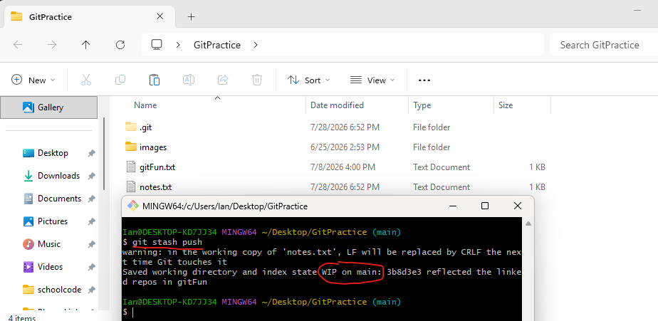

In the above example, I changed the contents of the \`notes.txt\` file,
and then stashed the changes. We can observe the reference to the stash
by going to \`.git/refs/stash\` directory.

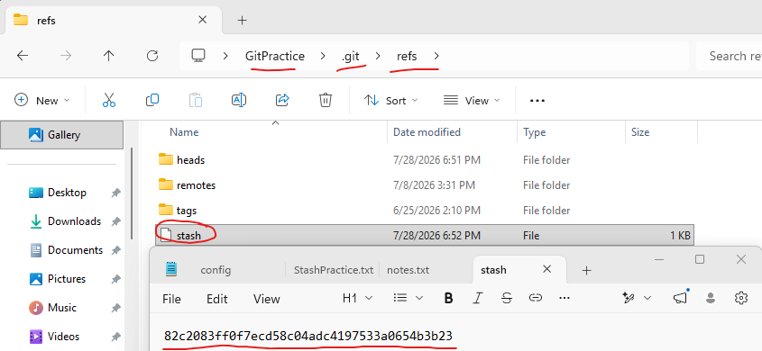

The above hash is the hash identifier to a commit object that represents
the stash, stored in the Git Object Database.

Git will index the stashes like stash@{0}, stash@{1}, etc. for however
many stashes that you have saved. The index starts at 0 and climbs by
one for each additional stash. The most recent stash will become
stash@{0} and bump each previous stash down by one index value.

It is important to note that stashing changes are not the same as
committing the changes. This is a temporary storage of the changes but
not a permanent commit that we can reference in the commit history.

------------------------------------------------------------------------

## Restoring Stashes

Once we have switched branches, how do we take the changes that we have
temporarily saved elsewhere and bring them to the correct branch? To do
this, we then need to use either the command \`git stash pop\` or \`git
stash apply\`. This will restore the changes that we saved and apply
them to the current branch that we are in.

### Difference Between Popping and Applying Stashes

Popping a stash will restore the changes that we have stashed and then
delete the stash. Although stashes are meant to be temporary storing
solutions, they are technically permanent in that Git will hold them
indefinitely. In most cases, we do not want to keep unnecessary stashes
stored and we would use the \`git stash pop\` method.

However, sometimes we do want to keep the stash for later use. In this
case, we would instead use the command \`git stash apply\`. This command
will apply the stashes that are currently saved and will not delete the
stashes afterwords.

If we want to pop or apply specific stashes, we can modify the command
to include the specific stash we want to use. We can do this by using a
command like \`git stash pop stash@{0}\`.

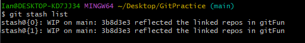

If we are unsure of which stashes are currently available to restore, we
can use the command \`git stash list\`. This will list each of the
stashes currently available to choose from. If we never named the stash,
Git by default gives each stash a description like "WIP on main" or "WIP
on development".

------------------------------------------------------------------------

## Naming Stashes

As explained in the previous section, Git by default will name each of
your stashes "WIP on {insert branch name}". This isn't exactly helpful,
because if we have multiple stashes for a particular branch, it may
become confusing. Instead, we can name the stashes ourselves.

When creating a stash, I said we can use the command \`git stash push\`.
We can augment this command by using the -m flag like \`git stash push
-m "{insert message}"\`. This command will allow us to assign a
description to a stash that acts as a name. This is much more complete
because we can leave a description like "unfinished login feature".

Now, when we use the command \`git stash list\`, assuming we have no
other stashes, our stash list will look something like:

stash@{0}: unfinished login feature

This will allow us to identify what each particular stash. This is
especially useful in the event we are using a command like \`git stash
apply\`, that does not delete stashes.

Here is a real example, where I create a stash for the \`notes.txt\`
file and name it. Then I list the stashes, and we can see the stash that
I named via its description.

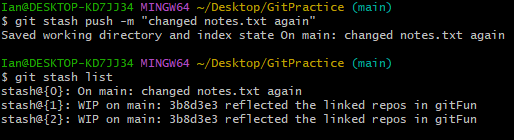

------------------------------------------------------------------------

## Removing Stashes

You have two options to remove stashes from the stash list. The first
option is to remove all stashes, which can be done with the command
\`git stash clear\`.

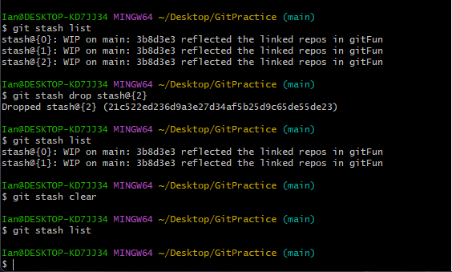

Alternatively, you can remove individual stashes by using the command
\`git stash drop stash@{insert index number}\`.

------------------------------------------------------------------------

## Partial Stashes

Let's dive into another situation that you may find yourself in. Perhaps
you have been grinding away at a login feature for a project and you
have been working in a particular file named \`login.js\`. While working
on this file, you noticed that the \`README.md\` file for the project
has a typo that also needs to be fixed. Rather than stopping your work
to make a separate commit for the README file, you fix it while
continuing to work on the login feature.

Before you finish the login feature, your project manager now comes to
you with an urgent fix you need to complete. To fix the issue, you need
a clean working directory. But the feature that you are currently
working on in \`login.js\` is not complete, whereas the \`README.md\`
typo is fixed.

Since the README typo is something that is complete and you were
planning to commit it, you may want to make a partial stash of the work
that is not complete. To do this, you will need to use the command \`git
stash push -p\`, where the -p flag is used to indicate that you want to
make a partial stash.

This command will bring up a series of questions from Git, asking you
which "hunks" you would like to stash. A hunk is a section of changes
within a file that Git groups together. A file may contain one or many
hunks depending on how the changes are grouped.

It will ask you in this simple scenario:

login.js

@@ ... (representing the changes in this hunk)

Stash this hunk? y (the y is user input indicating: yes, I would like
you to stash this hunk.)

README.md

@@ ... (representing the changes made in this hunk)

Stash this hunk? n (the n is user input indicating: no, I would not like
to stash this hunk)

The result will be the changes to \`login.js\` being stashed and only
the README.md changes remaining in the working directory. From here you
can add and commit the README fix. Then switch to the branch where the
urgent issue needs to be fixed, fix 🡪 add 🡪 commit 🡪 and push those
changes. Finally, switch back to the branch you were working in, and
restore the login work with \`git stash pop\`.

This is common in software development, where urgent bug fixes are
needed and you are working in a separate development branch at the time
the bug is discovered. Sometimes you need to drop what you are doing to
fix urgent bugs, but you do not want to lose the changes you have been
working on.

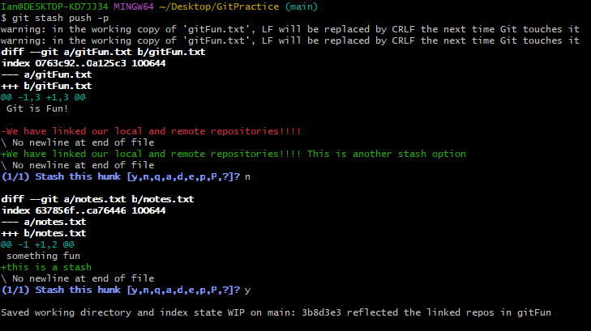

Above is an example of using the partial stash flag along with the
prompts that must be completed when choosing which hunks to keep. In the
first prompt, I selected no to the blue "Stash this hunk" prompt by
typing "n" and then pressing enter. Then for the second blue "Stash this
hunk" prompt, I selected yes by typing "y" and then pressing enter. We
can then see that the stash was successful with the line below the last
prompt.

------------------------------------------------------------------------

## Ignoring Files with .gitignore

Not every file belongs in a version control system. There also may be
files that pertain to a project that you store in your local repository
that are not appropriate to be in a shared remote repository. Perhaps
there are API keys, passwords, compiled files, temporary files, etc.
These files do not need to be tracked by Git and, in some cases, should
never be tracked by Git.

How do we tell Git which files to ignore then? Well, with a
\`.gitignore\`, of course. Jokes aside, \`.gitignore\` files are very
helpful when trying to control what enters version control.

In this repository, there is actually a \`.gitignore\` file that tells
Git explicitly that I do not want it tracking temporary files created by
Microsoft Word. (Yes, I create these files in Microsoft Word and then
convert them to markdown files for your convenience.)

A \`.gitignore\` file is simply a plain text file that is named
\`.gitignore\`. This means that you can create it in any text editor of
your choice and it will work as long as you save it to your project's
root directory.

From here, we can open the \`.gitignore\` file in our text editor of
choice. Inside of this file, we will define the files, particular types
of files, wildcards, or certain directories within the project that we
would like Git to ignore.

It is good practice to leave a comment above each item you are choosing
to ignore, so that you know what it is. For example, to ignore temporary
Word files I used the pattern "\~\$\*". Microsoft Word creates temporary
files that begin with this pattern in front of the original filename. Do
you think I would know that off the top of my head if I didn't include a
comment?

A good resource to figure out which files you would like to ignore for
specific project type is
<https://www.golinuxcloud.com/gitignore-examples/> . If you scroll to
the bottom of this page, it has real-world examples for project
templates. The exact layout of your \`.gitignore\` is up to you and may
need to be adjusted depending on the software, project type, etc.

If you have a file that is already being tracked within a project and
then you try to ignore that file, Git will continue to track that file.
In this case, we need to explicitly tell Git to stop tracking that file.

To do this, we need to use the command \`git rm \--cached {filename and
extension}\`. This will remove the file from Git's index but leaves the
local file intact. You then just need to commit and push your changes.
This will cause Git to remove the file from the remote repository, no
longer track the file, and leave your local version of the file intact.

One very important note is that any sensitive file that is removed from
the cache and added to the \`.gitignore\` file, that has already been
committed and pushed in the past is compromised. Removing a file from
your repository does not remove it from existing in your repository's
history. We will discuss in a later guide how to rewrite history like
this. This particularly pertains to passwords, API keys, features
involving security, etc.

------------------------------------------------------------------------

## Global Ignore vs Repository Specific Ignore

It would be really annoying if you had to declare to Git that you want
it to ignore the same types of files every time you created a new
project. Thankfully, Git has global ignore configuration settings that
can be used in addition to the repository specific Git ignore files.

To see if you already have a global ignore file, you can open a Git Bash
terminal and type the command \`git config \--global
core.excludesfile\`. This will give you the path on your computer to the
file if it exists already. If it does not exist or the path has not been
set yet, you must create it yourself. To do this, open a text editor and
include what you would like to ignore globally as the contents of the
file. Then, you need to save the file as \`.gitignore_global\` in a
directory on your computer that makes sense (such as
C:/Users/{yourName}/.gitignore_global).

Next, you need to tell Git where to look for this file. You can do this
by using the command \`git config \--global core.excludesfile
C:/Users/{yourName}/.gitignore_global\`. To verify if Git is using your
global ignore file, use \`git config \--global core.excludesfile\` and
see if the file path is correct.

The difference between this way of ignoring files and using the
repository specific version, is that the repository version will ignore
the files that you tell it to for everyone that contributes to the
repository. This is in contrast to the global ignore file that will only
ignore those types of files for you.

------------------------------------------------------------------------

## Personal Access Tokens (PATs)

GitHub uses something called Personal Access Tokens (PATs) as one method
of authenticating Git operations over HTTPS. GitHub used to use your
username and password for authentication of Git operations, but
passwords provide too broad of access and are difficult to securely
manage in automated actions/workflows.

A PAT acts like a secure replacement for a password that can have
different levels of scope and permissions. For instance, I could have a
PAT that allows me to automate actions across repositories that the
token has been granted access to.

Alternatively, you can create more restricted tokens that only have
access to specific repositories or permissions called fine-grained
tokens. In cybersecurity, this is called the principle of least
privilege; if a token becomes compromised, the damage is limited only to
the access that the token was granted.

Additionally, you can set expiration dates for PATs, requiring them to
be replaced periodically. It may be inconvenient, but this reinforces
the idea of security. This reduces the risk of old or forgotten
credentials remaining indefinitely and eventually becoming compromised.

------------------------------------------------------------------------

## Creating and Managing PATs

Creating and managing Personal Access Tokens is quite simple. First,
open GitHub within a browser. Then sign-in if you need to and navigate
to your avatar logo in the top right corner of the browser. Next, click
on the "Settings" option from the dropdown menu.

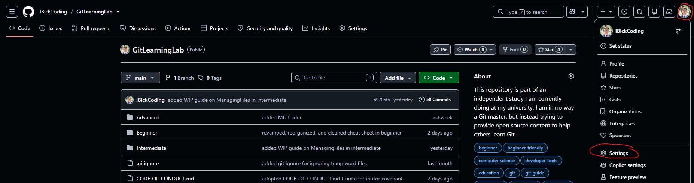

Within the menu that appears after navigating to settings, select the
"Credentials" option.

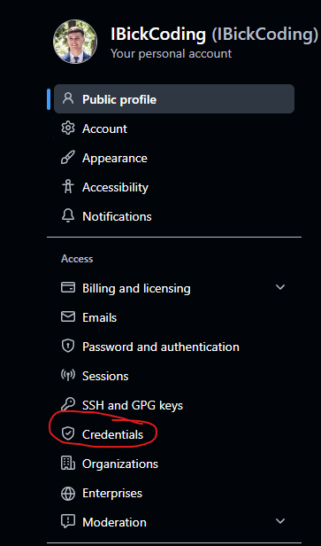

From here, you will see the credentials page appear. You have the option
of selecting a fine-grained PAT or PAT (classic). The additional options
below these two options will be covered in a later guide. For now, we
will click on the Personal Access Token (classic) option. Classic tokens
are simpler tokens that are not as restrictive as fine-grained tokens,
but it is important to mention that GitHub considers the classic tokens
to be legacy and recommends fine-grained tokens whenever possible. For
the sake of simplicity in this guide though, we will be using the
classic tokens option.

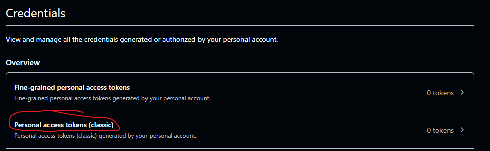

Next, you need to select the "Generate new token" drop down menu and
again select the classic version of the token.

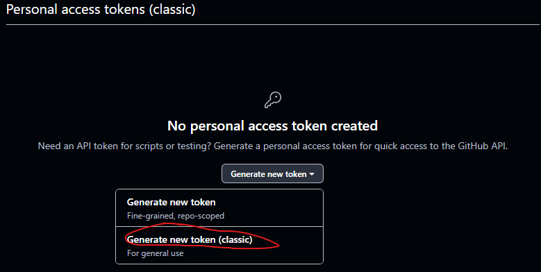

GitHub may prompt you to sign-in again, do so if you need to. We will
then be met with the new token creation page. From here, we can select
options that we would like to include within this token. Note that since
this is a classic token and not a fine-grain token, we cannot choose
which repositories that this token is applicable to. It will have access
to whichever repositories that I have permissions to contribute to.

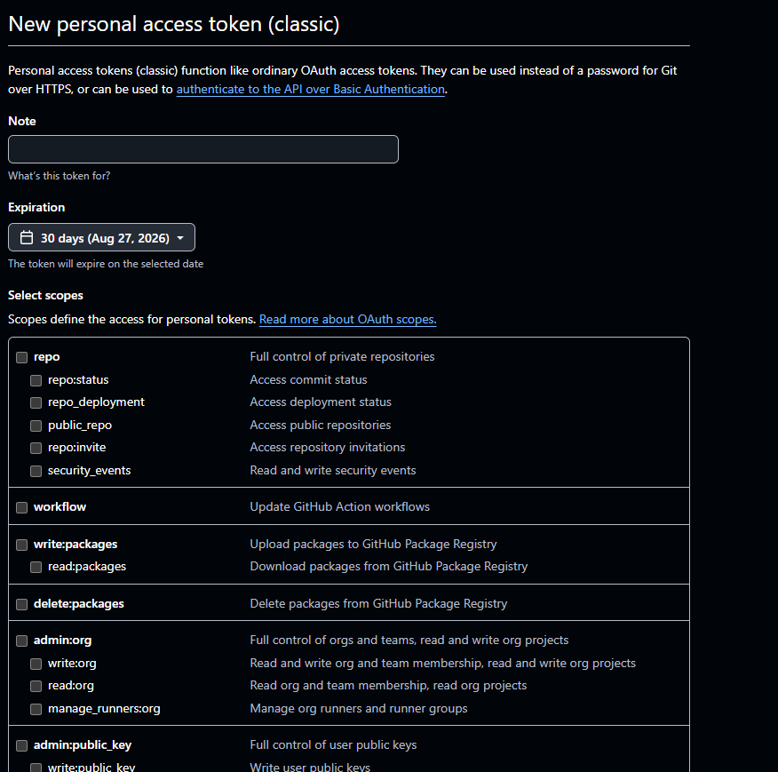

From here, we have the option to give permissions to this particular
token. In the first section, we have the option to leave a note about
what this token is being used for.

Next, we can set the expiration date from a drop-down menu. The scopes
section are the permissions that we are giving this token. A lot of
these permissions are for more complex and sophisticated repositories
but one commonly used one that is useful is the option for repos. This
will allow us to use this token in conjunction with repositories that we
have permissions to contribute to and be able to manage automations in
that repository. By selecting the checkbox next to the word "repo", we
can auto select all the options that fall into "repo".

After this option, we do not want to give any additional permissions to
the token. This is to ensure we adhere to the principle of least
privilege and do not assign more permissions than the token needs. We
can now scroll to the bottom of the page and select the "Generate Token"
option.

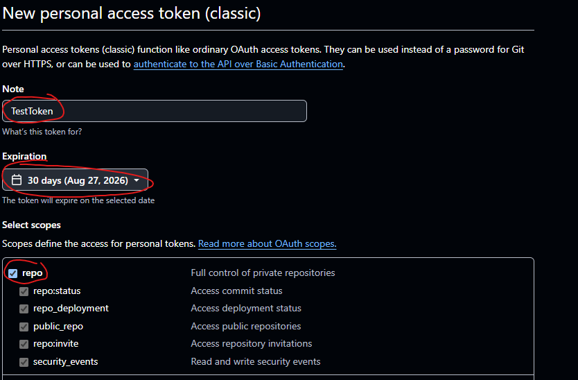

Once you select the generate token button, you will be brought to a page
that will give you your PAT. This is the ONLY time GitHub will display
your PAT, for security reasons. It is important to store this token in a
secure location that only you can access, as you will no longer be able
to see the value of this token after you leave this page.

To store something like a PAT, you should use some form of credential
manager that will not only store your PAT but encrypt it. A compromised
PAT could allow unauthorized access or contributions to the repositories
that the PAT has access to. I would recommend using something like the
Git Credential Manager, which is an open-source credential management
tool. It works on Linux, Windows, and MacOS and was originally developed
by Microsoft and is now maintained by the Git Ecosystem organization. A
link to the credential manager, installation instructions, and usage
instructions can be found here:

<https://github.com/git-ecosystem/git-credential-manager>

## When to Use PATs

PATs can be used in place of a password for authenticating Git
operations over HTTPS. This means we could use the PAT to authenticate
our changes in a repository.

To do this, we would need to "clear" the credentials that we currently
have set up for Git by using the command \`git credential reject\`.

Git will then require you to input the credential information that you
want to remove; in our limited case it would be:

protocol=https

host=github.com

This will forget the credentials that we previously had stored for
GitHub over HTTPS and will allow us to use our username and the PAT we
created rather than our account password when authenticating operations.

Why is this useful? It gives you a more controlled method of
authentication, because if a PAT becomes compromised, we can limit the
permissions that the PAT is granted. In contrast, a compromised password
could give full access to our GitHub account. It is not entirely
necessary for everyday use, but it is nice to know that you have the
option for more control in authentication.

Later, in the Advanced guides of this series, we will learn that we can
use PATs for third-party automations where PATs become much more
important. By that point, we will understand what a PAT is, its
function, and how to create one, allowing us to go over the more
important details of automation rather than PAT creation.
