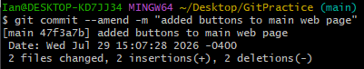
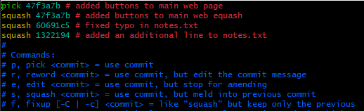
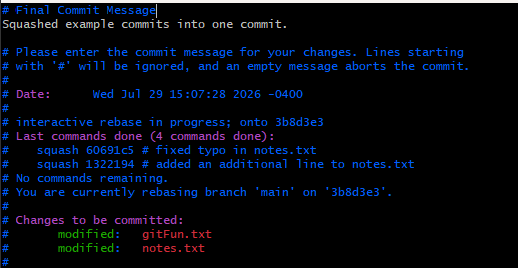
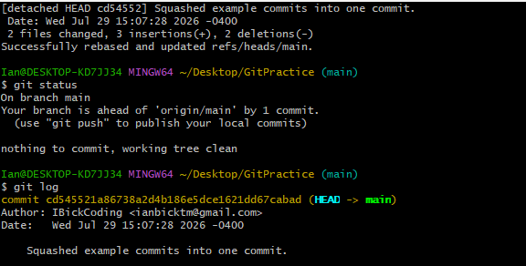

# Learning Objectives:

By completing this guide, learners will be able to:

1.  Explain why a developer may want to rewrite history.

2.  Identify where rewriting history may improve repository quality.

3.  Explain the difference between rewriting private history and
    rewriting public history.

4.  Modify the most recent commit within a repository.

5.  Change commit messages after a commit has been created.

6.  Use interactive rebase to modify multiple commits.

7.  Explain how interactive rebase rewrites commit objects.

8.  Reorder commits in commit history.

9.  Combine multiple commits into one commit.

10. Rename commit messages.

11. Remove commit objects.

12. Explain why rewritten commit objects will have different hashes from
    the original commit object.

13. Explain why force pushing is required after rewriting remote
    history.

14. Apply best practices when rewriting shared repository history.

15. Determine when history should and should not be rewritten.

------------------------------------------------------------------------

## Introduction

We have learned in previous guides that commits are immutable objects,
meaning that once a commit object has been created, its contents cannot
be modified. We know that a commit object contains metadata that
indicates the author, message, timestamp, parent commit, and tree.
Changing any of these values will create a new commit.

Since a commit's hash identifier is generated from the contents of the
commit object, any change to the metadata of the commit will result in a
different hash, even if the actual file changes contained by the commit
remain the same. It is through this idea that we can "rewrite" commit
history by creating new commits that take the place of old commits in
history.

------------------------------------------------------------------------

## Why Rewrite History?

A logical question to ask is why you would even want to rewrite history.
As I do in these guides, let's take a scenario to break down why it may
be useful to rewrite history.

Let's assume that you are a developer working on the front-end of a
website. On this front-end, we have several buttons that perform
different actions. The specific functionality of these buttons is not
important. What matters is that another developer's work depends on your
changes, so the feature needs to be completed quickly.

As you are working, you are attempting to make this button function as
you designed them to. When you are working on them locally, you notice
that they work as intended. However, once you commit and push them to
your remote repository that is connected to the website's deployment
workflow, you notice that the buttons do not function as they did
locally. Sometimes this happens because the environment is different,
there are different dependencies, missing files, etc. But the important
thing to note is that the buttons do not function as needed.

You decide, as the good programmer you are, to immediately work on
fixing the buttons. You are confident that your solution will make the
buttons function as intended and push the new fix up to the remote
repository. Again, the buttons don't function as intended. Once again,
you decide to try and fix the buttons. Finally, you notice the issue
that is causing the buttons not to work. You have a git ignore file that
is excluding a key file that is necessary for the buttons to function.
You remove the file from the git ignore and push your changes to the
remote repository.

Your button finally works! However, you have created quite a messy
commit history in the wake of the button dilemma. You have commits that
look like "added all needed buttons to main page of website", "fixed
buttons", "fixed buttons again", "fixed buttons, but for real this
time". Instead of having four separate commits for adding the buttons to
the main page of the website, we can instead consolidate them into one
commit with the original message but the functionality of the last
commit. Furthermore, we can leave out unnecessary debugging attempts in
the project's history.

------------------------------------------------------------------------

## The Golden Rule of Rewriting History

NEVER REWRITE HISTORY THAT OTHER PEOPLE ARE ALREADY DEPENDING ON. This
is the most important rule to consider when trying to decide whether
rewriting commit history is appropriate. As we know, a commit hash
identifies the content of a commit object. Since a commit object
contains a reference to its parent commit, changing any commit in the
chain will also change the hash of every single commit that comes after
it.

If you rewrite a commit, Git does not modify the original commit as if
it were time traveling. Instead, it creates a new commit with a new hash
identifier, which is now the commit that is referenced in the rewritten
history. Everyone else may still have the old commit history, but you
now have a new commit history. This creates two different versions of
the commit history, which can cause the histories to diverge
unintentionally.

Diverged commit histories become a problem because other teammates may
have commits based on the old history, pulling the changes may now
require complicated merges, and force pushing the changes to the remote
repository may overwrite someone else's work. This is all stuff we want
to avoid as it causes unnecessary chaos that could be prevented.

------------------------------------------------------------------------

## Public vs Private Rewrites

Before we go over how to rewrite history, there is an important
distinction that needs to be made.

Private history is the history that exists only in your local
repository. No other team member can access or depend on these commits
until they are pushed to the remote repository.

In contrast, public history is the history that exists in your remote
repository. This history is shared and can be used by other team
members.

Typically, these histories are in alignment with each other. However,
when you rewrite history you may change the local history, the remote
history, or both. When this happens, the histories must be synchronized
again.

------------------------------------------------------------------------

## Methods of Rewriting History

Now that we understand why rewriting history works, the dangers
associated with it, and a rough idea of when to do it, we can look at
the various ways we can rewrite history.

Common methods of rewriting history include:

- Amending commits

- Squashing Commits through interactive rebasing

- Reordering commits

- Dropping commits

- Resetting history

### Amending Commits

Amending commits is the simplest form of rewriting commit history. A use
case for amending a commit is when you have a typo in your last commit
message and would like to fix it, such as "added buttns to main web
page".

To fix this typo, we would use the command \`git commit \--amend -m
"added buttons to main web page"\`. This will create a new commit object
to replace the old commit object with the corrected message.

Additionally, if you forgot to stage a file in your previous commit that
you have not pushed yet, you can add the changes to the staging area
using \`git add {filename}\` and then \`git commit \--amend\` to include
them in the previous commit.

### Squashing Commits

Squashing commits is the process of taking two or more commits and
combining them into one commit. A use case for something like this is
when you are working on a feature and you notice that you are creating a
lot of small commits that belong to the same feature.

An example of this would be creating a log-in feature, where you have
commits such as "added login page", "added login button", "fixed login
button", "added text fields for login". All of these can be summed up
into one commit that has a message of "added login feature".

The commits in this example before squashing them would look like: A 🡨 B
🡨 C 🡨 D. After squashing the commits, your commit history would look
like A 🡨 E, which looks far cleaner for the single feature that was
added.

To do this, we will need to use the command \`git rebase -i
HEAD\~{number of commits you want to squash together}\`. This will open
an editor with the last n commits where n is the number of you
specified. The commit that appears on top you will keep as "pick", and
the rest you will change the wording to "squash". You can see an example
of this in the image below.

Next, press the escape button and then type ":wq" (w stands for write
and q means to quit the editor.) to close this editor and a new editor
will appear.

Here you will see the commit messages of all the commits that you are
squashing. You can delete everything regarding commit messages and add a
new commit message or keep one of the old ones. In this case, I wrote a
new commit message. When you are finished, press the escape button again
and type ":wq" again to write and quit the editor.

We will finally get the above output, that says that the rebase was
successful. If we run \`git status\` now, we can see that our branch is
1 commit ahead of the remote branch. If we check \`git log\` we can see
that the commit that has not been pushed yet is the squashed commit with
the new message.

### Reordering Commits

Reordering commits is done through interactive rebasing too. The command
remains the same as squashing \` git rebase -i HEAD\~{number of commits
to reorder}\`. To reorder commits, you would just move the content from
one line that is below another to a new position above. Since Git
executes from top to bottom, any commit above another will appear first
in commit history. To exit the editor, press escape and type ":wq" to
write and quit.

It is important to note that if you try reordering commits that affect
the same line within a file and Git is not able to apply them cleanly,
Git may encounter conflicts and pause the rebase until you resolve them.

### Dropping Commits

Dropping commits can also be done through interactive rebasing. Dropping
a commit just removes the commit from the commit history. The command
still remains the same as both squashing and reordering. To drop a
commit, replace the word in front of the commit you want to remove with
the word "drop". Then press the escape button and type ":wq" to write
and quit.

### Resetting History

Resetting history is the process of moving a branch reference to point
to a past commit in the commit history. For instance, if we want to
reset the branch to an older commit that is 2 commits behind the most
recent, we would use the command \`git reset \--hard HEAD\~2\`. If we
had a repository history that looked like A 🡨 B 🡨 C 🡨 D and used this
command, our history would now look like A 🡨 B. Commits C and D are not
permanently lost, but they are now unreachable from typical branch
navigation techniques. If we wanted to recover them, we would have to
use \`git reflog\`. This command is covered in a previous guide.

------------------------------------------------------------------------

## Force Pushing

If you choose to rewrite history on commits that have yet to be pushed
to the remote repository and have only existed in your local repository,
we are golden. However, if you choose to rewrite history that has
already been pushed to a remote repository, we run into issues.

When you try to push your rewritten commit history to the remote
repository in the latter option, the push will fail. This is because Git
notices the repositories' histories are not the same. You have a new
history, but your remote repository has the old history. If we choose to
rewrite the remote repository after weighing the risks, how can we push
our changes?

You can do this with the command \`git push {remote} {branch}
\--force\`. This tells Git that you are aware of the issue it is trying
to raise, but that you want it to force the push anyway. Essentially,
you are telling Git "Replace the remote repository's history with mine."

------------------------------------------------------------------------

## Dangers of Force Pushing

If we have a team that is working on a project, the history of the
project looks like:

A 🡨 B 🡨 C 🡨 D

Then we have someone on the team that rewrites the history by squashing
commits C and D and then force pushes the new history to the remote
repository. We now have a history that looks like:

A 🡨 B 🡨 E

If we have another team member that tries to push a new commit to the
remote repository, Git can no longer add the new changes because the
commits are based on different versions of history.

In this specific example, the issue would not be that difficult to fix
because Commit E contains the changes from both Commit C and Commit D.
The team member may still be able to recover their work by rebasing
their changes onto the new history. But if we were to drop Commit D
rather than squashing it with Commit C, resolving the conflict becomes
much more complicated if the changes made in the new commit being added
depended on the changes made in Commit D.

------------------------------------------------------------------------

## Force-with-lease

There is a safer option other than outright attempting to force push
changes to the remote repository. We have the option to use the command
\`git push \--force-with-lease {remote} {branch}\`. What this command
does is verify if the remote is still pointing to the same commit that
your remote-tracking branch believes the remote should be pointing to.
For example, assume your last \`git fetch\` command has your
remote-tracking branch pointing to Commit D. Git will use
force-with-lease to verify that the remote is still pointing to Commit D
before attempting to force push.

If the remote has changed since the last \`git fetch\`, the force push
will fail because Git will refuse to make the force push. This is
intentionally designed to try and alleviate the chance of the issues we
discussed in the previous section. This is what makes force-with-lease
safer than the force push option.

However, if the remote has not changed since the last \`git fetch\`, Git
will allow you to make the force push. This does not mean that nobody is
using the commit you are changing in their current work, but it does
eliminate the possibility of overwriting commits that another team
member has already pushed to the remote since your last \`git fetch\`.

Whenever you are attempting to rewrite public history like this, it is
preferred that you use force-with-lease over a normal force push, as
this option has an additional safety check that can help prevent
overwrites of someone else's work.
